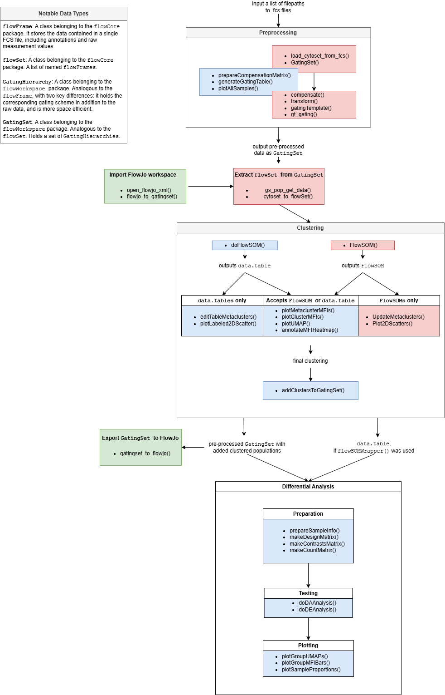

# flowFun

``` r

library(flowFun)
```

To improve the accessibility of the package, `flowFun` provides a number
of template scripts for users to make getting started less daunting.
When viewing the GitHub page, these may be found in the `\scripts`
folder.

`flowFun` was also designed to allow users to easily import and export
data at any stage of the analysis. This page will give a brief overview
of the pipeline and how users may import their data at each step. The
diagram below summarizes each function relevant to the package, and
which step they fit into.



The most important data type in this pipeline is the `GatingSet`, which
comes from the `flowWorkspace` package. Users who have performed flow
analysis in R before may be familiar with the `flowSet`, which is quite
similar. Both store all raw data from a set of FCS files, but
`GatingSets` are more advantageous for a few reasons. For one, in
addition to the raw data, `GatingSets` can hold information about
transformations, compensations, and gating schemes that are applied
during analysis. Instead of having multiple sets of FCS files
corresponding to raw data, preprocessed data, various subsets, etc.,
this data structure conveniently keeps everything in one place.

Additionally, `GatingSets` are far more memory efficient than
`flowSets`. Rather than always having the full dataset loaded in memory,
a `GatingSet` contains only a pointer to the data, which is stored
compactly in C data structure. This makes performing operations on large
datasets faster.
