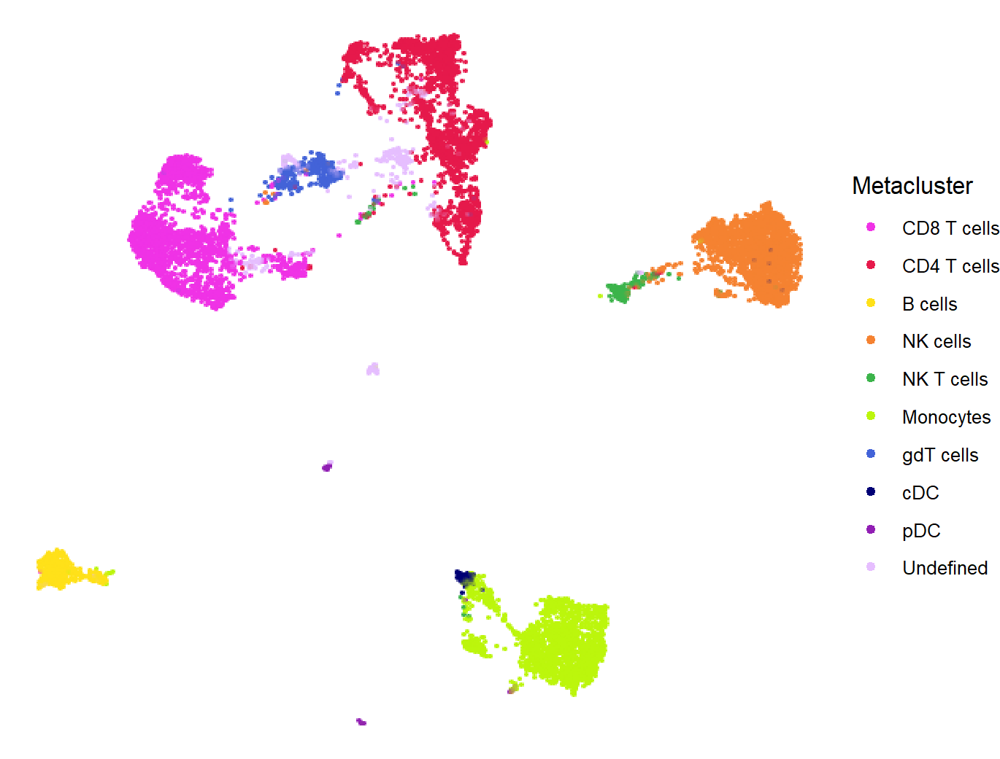
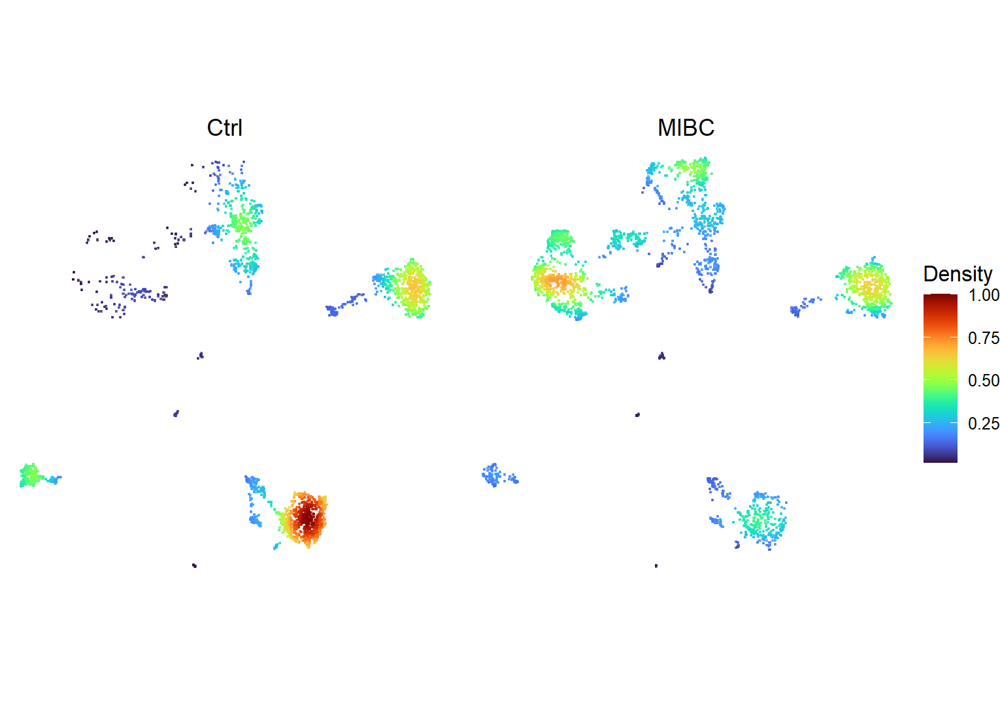
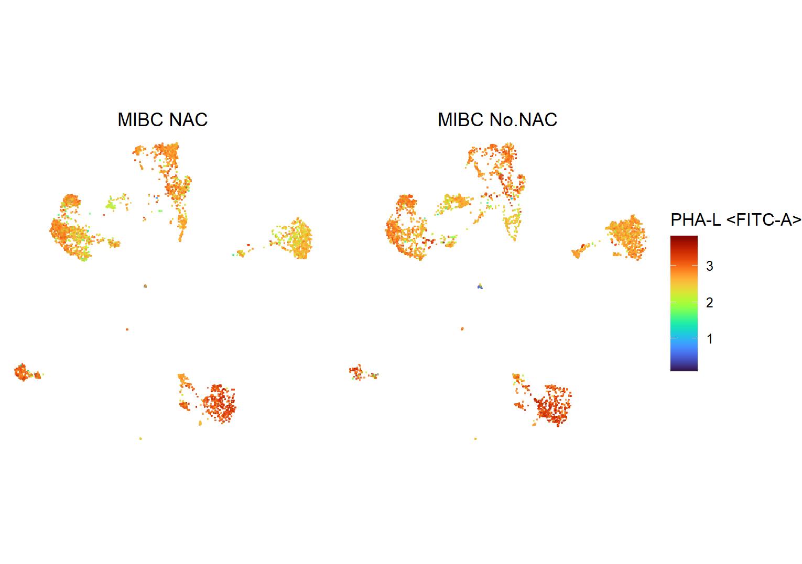
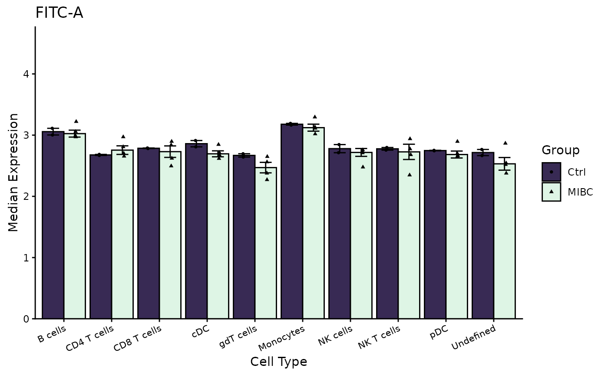
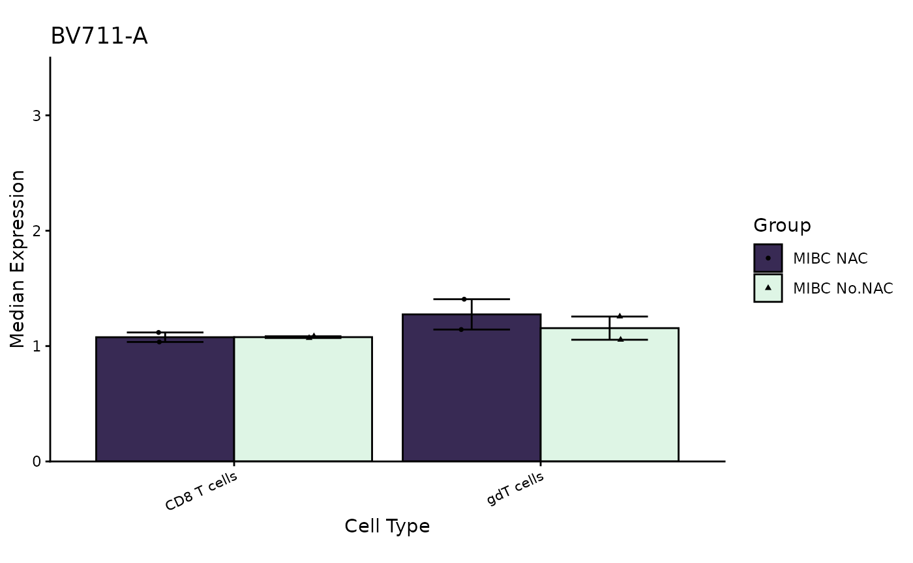
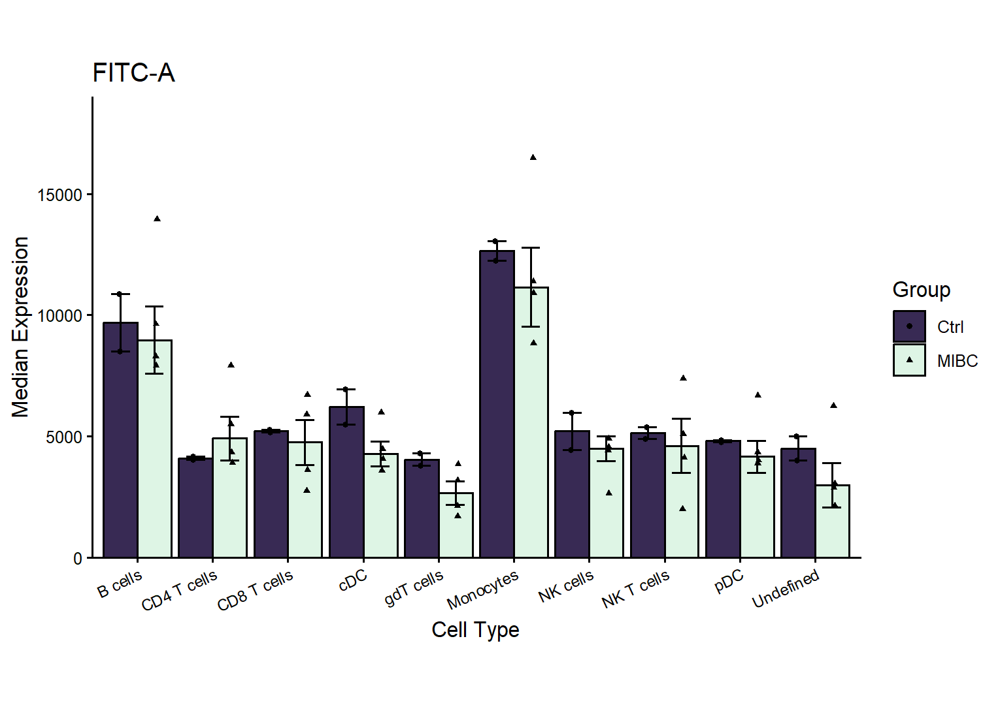
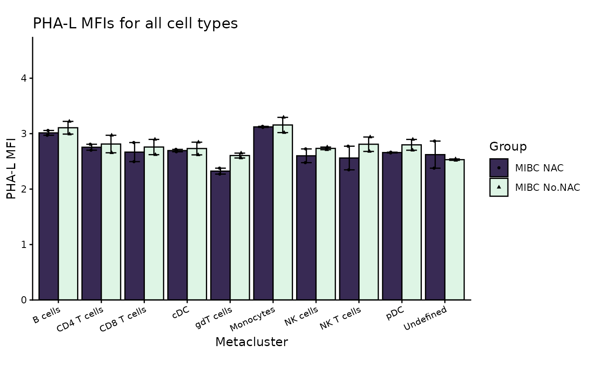
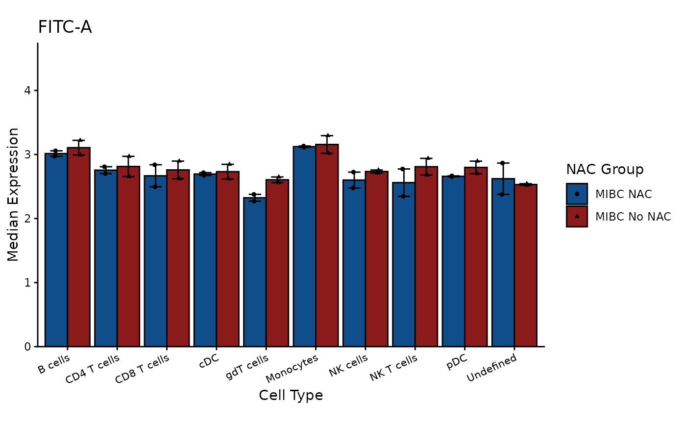
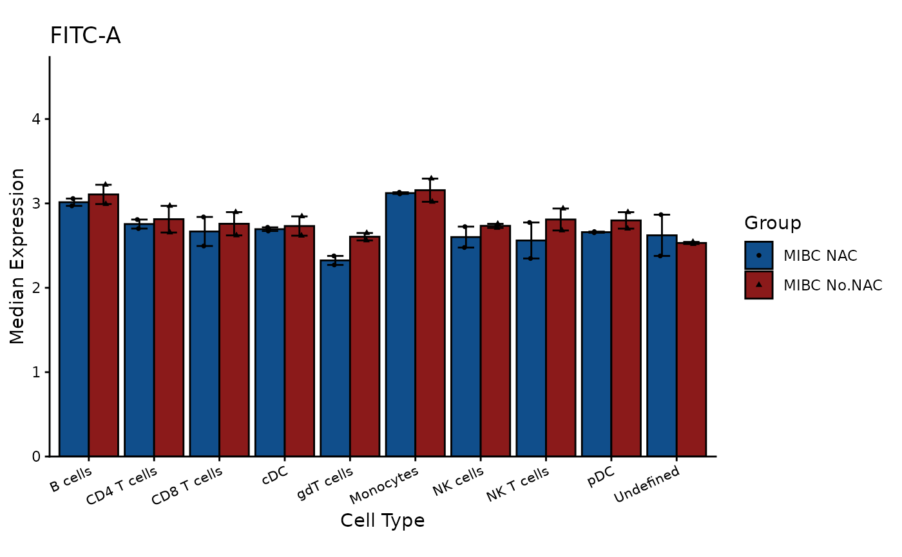
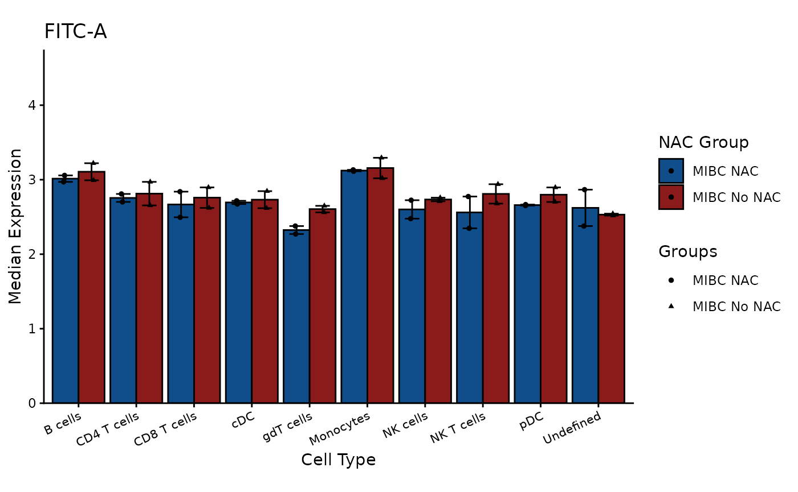

# Making and editing plots

## Setup

In this script, we’re assuming that we already have a finalized
clustering of our cell population, so only analysis after this step will
be shown. Specifically, comparative analysis and visualizing results.

Below we read in our clustered data, define the comparisons between
groups we would like to test, and supply a .csv file to tell the script
more about each file.

It’s important to make sure that the `comparisons` parameter is defined
properly. Try `?prepareSampleInfo()` and read the examples of how to
define it if you are unsure.

``` r

# Specify path to file with clustered data
data_file <- system.file("extdata", "fsom_dt.rds", package = "flowFunData")
fsom_dt <- readRDS(data_file)

# Make a nested list defining any comparisons you wish to make. See the examples
# in documentation for prepareSampleInfo() for a detailed explanation.
comparisons = list(
  ctrl_vs_mibc = list(disease = list("MIBC", "Ctrl")),
  nac_vs_no_nac = list(disease = "MIBC", NAC = list("NAC", "No.NAC"))
)

# Get path to file with sample information; must have a column for filenames
info_file <- system.file("extdata", "sample_info.csv", package = "flowFunData")

# Read in this file and prepare it for the pipeline
sample_info <- prepareSampleInfo(info_file,
                                 name_col = "sample.name",
                                 filename_col = "filename",
                                 comparisons = comparisons)

# Print the first few entries of `sample_info` to see what the .csv file should 
# look like
head(sample_info)
```

    ##   sample.name     filename disease    NAC              FMO          Isotype
    ## 1      Ctrl 1 sample_1.fcs    Ctrl      X FMO_sample_1.fcs Iso_sample_1.fcs
    ## 2      Ctrl 2 sample_2.fcs    Ctrl      X FMO_sample_2.fcs Iso_sample_2.fcs
    ## 3      MIBC 3 sample_3.fcs    MIBC No.NAC FMO_sample_3.fcs Iso_sample_3.fcs
    ## 4      MIBC 4 sample_4.fcs    MIBC No.NAC FMO_sample_4.fcs Iso_sample_4.fcs
    ## 5      MIBC 5 sample_5.fcs    MIBC    NAC FMO_sample_5.fcs Iso_sample_5.fcs
    ## 6      MIBC 6 sample_6.fcs    MIBC    NAC FMO_sample_6.fcs Iso_sample_6.fcs
    ##         group
    ## 1      Ctrl_X
    ## 2      Ctrl_X
    ## 3 MIBC_No.NAC
    ## 4 MIBC_No.NAC
    ## 5    MIBC_NAC
    ## 6    MIBC_NAC

Note the added `group` column; this will be used later.

## Plotting UMAPs

Here we show how to use the functions for plotting UMAPs in `flowFun`.
It is only necessary to specify your data object. However, it is highly
recommended that at the very least, a seed is specified, so that your
results are replicable. By default, 5000 cells are used for plotting.

``` r

# Color single default UMAP by metacluster
plotUMAP(fsom_dt, seed = 42)
```


We may also manually specify the number of cells that should be used,
the order the legend elements should appear in, and the colors to use
for each metacluster. Note that while color codes are manually chosen
here, it can also be convenient to use packages designed for this
purpose, like `viridis` or `RColorBrewer.`

A much larger number of cells is used for plotting here, because we will
next be splitting the plot by group and recoloring.

``` r

# Define colors to use
colors <- c("#F032E6", "#E6194B", "#FFE119", "#F58231", "#3CB44B", 
            "#BCF60C", "#4363D8", "#000075", "#911EB4", "#E6BEFF")
            # "#46F0F0",  "#008080", "#E6BEFF", "#FF4500", "#800000", "#0000FF"

# Define order labels should appear in the legend
labels <- c("CD8 T cells", "CD4 T cells", "B cells", "NK cells", "NK T cells", 
            "Monocytes", "gdT cells", "cDC", "pDC", "Undefined")

# Plot a UMAP according to custom choices
umap_full <- plotUMAP(fsom_dt, num_cells = 10000, labels = labels, colors = colors, seed = 42)
umap_full
```



To create UMAPs for the purpose of comparing groups, you may use a
previously created aggregate UMAP, like the one above, by specifying the
parameter `umap`. If you do not do this, a new UMAP will be generated.

`num_cells` specifies the number of cells to include in the plot for
each group. Note that, if you are generating the figure using a previous
UMAP, this parameter is bounded by the number of cells for that group
that already exist in that UMAP. If `num_cells` cannot be reached, the
function instead sets it to the cell count from the least abundant
group, and states the actual number of cells that were used for
plotting.

``` r

# Color UMAPs by density for Ctrl vs. MIBC, using above plot
plotGroupUMAPs(fsom_dt, 
               sample_info, 
               comparisons[[1]], 
               umap = umap_full)

# Color UMAPS by PHA-L expression, MIBC NAC vs. MIBC No.NAC
plotGroupUMAPs(fsom_dt, 
               sample_info, 
               comparisons[[2]], 
               umap = umap_full,
               color_by = "FITC-A")
```



## Bar plots

In this section we demonstrate how to create bar plots for MFIs or
counts by group. For most cases, all that’s needed is a call to the
function
[`plotGroupMFIBars()`](https://00berst33.github.io/flowFun/reference/plotGroupMFIBars.md).
The chunk below demonstrates a basic call to this function, using the
`data.table` as input.

Note that the parameter `comparison` is what dictates the groups
plotted. Specifying it is straightforward, as any groups to be tested
for differences should have been listed in one of the very first objects
defined during differential analysis, `comparisons`. The first element
of the `comparisons` object we defined above is
`ctrl_vs_mibc = list(disease = list("MIBC", "Ctrl"))`, so by setting
`comparison = comparisons[[1]]` this call will plot differences between
the experimental and control groups. The group each sample belongs to is
determined using the `sample_df` parameter. The channel to plot MFIs for
is chosen with the `col` parameter, which in this case is `"FITC-A"`.

``` r

# MIBC vs. Ctrl, CD8 T cells
plotGroupMFIBars(fsom_dt, 
                 sample_df = sample_info, 
                 col = "FITC-A",
                 comparison = comparisons[[1]])
```



When given a `data.table`, the default behavior of this function is to
plot all metaclusters, but if they wish to only plot particular
populations, users may specify them with the `populations` parameter.
There is also the optional parameter `upper_lim`, which sets the limit
on the y-axis.

``` r

# NAC vs. No NAC
plotGroupMFIBars(fsom_dt, 
                 sample_df = sample_info, 
                 col = "BV711-A",
                 comparison = comparisons[[2]], # plot NAC vs. No NAC groups
                 populations = c("CD8 T cells", "gdT cells"),  # choose specific populations to plot
                 upper_lim = 3.5) # set y-axis upper limit to 3.5
```



[`plotGroupMFIBars()`](https://00berst33.github.io/flowFun/reference/plotGroupMFIBars.md)
also takes `GatingSets` as input. In this case, including the
`populations` parameter is necessary, since unlike the `data.table`, our
`GatingSet` contains the full gating scheme and all raw data, and
therefore needs more specificity.

Finally, it should be noted that if your data was transformed during
pre-processing, you will likely want to back-transform it to a linear
scale before plotting so that the results are easier to interpret. You
may notice that the differences between cell types are quite small in
the plots above. When input is a `GatingSet`, users can set the
parameter `inverse = TRUE` and this will be done automatically for them.
The below chunk is an example and is not run, but would produce the same
plot shown just after.

``` r

# Read in GatingSet previously saved to disk
gs <- flowWorkspace::load_gs("project/gatingset_folder")

# Get children of node that was clustered on
subpopulations <- flowWorkspace::gs_pop_get_children(gs, 
                                                     y = "live_cells", 
                                                     path = "auto") # shortens path name automatically

# Call with GatingSet
plotGroupMFIBars(gs, 
                 sample_df = sample_info, 
                 col = "FITC-A",
                 comparison = comparisons[[1]], 
                 populations = subpopulations,
                 inverse = TRUE)
```

If input is a `data.table`, it does not have information about the
transformation that was applied to it, so users must specify it with the
parameter `transformation` when they wish to back-transform before
plotting.

`transformation` should be of the class `transformList` from the
`flowCore` package. If the `data.table` is a realization of a
`GatingSet` that was either transformed with
[`flowWorkspace::transform()`](https://rdrr.io/r/base/transform.html),
or transformed in and imported from FlowJo, the appropriate data type
may be extracted from it with the function
[`flowWorkspace::gh_get_transformations()`](https://rdrr.io/pkg/flowWorkspace/man/gh_get_transformations.html)
as shown below.

``` r

# Extract transformation from GatingSet
trans_list <- flowWorkspace::gh_get_transformations(gs[[1]],
                                                    only.function = FALSE) # do not exclude this argument

# Plot MFIs
plotGroupMFIBars(fsom_dt, 
                 sample_df = sample_info, 
                 col = "FITC-A",
                 comparison = comparisons[[1]], 
                 transformation = trans_list,
                 inverse = TRUE)
```



### Plot customization

Below are some examples regarding basic customization of bar plots made
with `ggplot2`.

If you are only interested in changing axes and title names, add the
`labs()` function from `ggplot2`.

``` r

p <- plotGroupMFIBars(fsom_dt, 
                      sample_df = sample_info, 
                      col = "FITC-A",
                      comparison = comparisons[[2]], 
                      transformation = trans_list,
                      inverse = TRUE) 

p +
  labs(title = "PHA-L MFIs for all cell types", 
       x = "Metacluster",
       y = "PHA-L MFI")
```



To customize the colors, point shapes, and legend, use
`scale_fill_manual()` and `scale_shape_manual()`.

``` r

p + 
  scale_fill_manual(name = "NAC Group",                                # renames legend title for group bars,
                    labels = c("MIBC NAC", "MIBC No NAC"),             # picks new names for legend items
                    values = c("dodgerblue4", "firebrick4")) +         # picks new colors for bars
  scale_shape_manual(name = "NAC Group",                               
                     labels = c("MIBC NAC", "MIBC No NAC"),            
                     values = c("circle", "triangle"))                 # picks new shapes for data points
```



If you only wish to change colors, just specifying `values` is enough.

``` r

p + 
  scale_fill_manual(values = c("dodgerblue4", "firebrick4")) 
```



Note that giving different parameters to the `name` and/or `labels`
parameters results in two legends.

``` r

p + 
  scale_fill_manual(name = "NAC Group",                             
                    labels = c("MIBC NAC", "MIBC No NAC"),           
                    values = c("dodgerblue4", "firebrick4")) +         
  scale_shape_manual(name = "Groups",                               
                     labels = c("MIBC NAC", "MIBC No NAC"),            
                     values = c("circle", "triangle"))  
```


