# flowFun

## Installation

Data used for this vignette is kept in a separate R package,
`flowFunData`. To install `flowFun` with built vignettes, users should
run the following code.

``` r

install.packages("devtools")

# Install with vignettes
#   The package 'flowFunData' must first be installed
devtools::install_github("00berst33/flowFunData")
#   Then install flowFun
devtools::install_github("00berst33/flowFun", dependencies = TRUE, build_vignettes = TRUE)
```

Otherwise, to get started with the package more swiftly, the user may
install `flowFun` without its vignettes.

``` r

install.packages("devtools")

# Install without vignettes
#   No installation of 'flowFunData', set argument `build_vignettes` to FALSE
devtools::install_github("00berst33/flowFun", dependencies = TRUE, build_vignettes = FALSE)
```

## Data Import

Blob Cytometry data often contains millions of cells, so to facilitate
fast and efficient manipulation of these large datasets, this package
implements data structures from the `flowWorkspace` package;
particularly the `cytoframe`, `cytoset`, `GatingHierarchy`, and
`GatingSet`.

The `cytoframe` and `cytoset` are analogous to the more well known
`flowSet` and `flowFrame` structures, but instead of storing data in
memory they store only a pointer to the underlying data (i.e. they are
reference classes). The size of this pointer is negligible compared to
the size of cytometry datasets, making operations with `cytosets` and
`cytoframes` far more memory efficient.

The `GatingHierarchy` and `GatingSet` build upon the `cytoset` and
`cytoframe`. They store not just the single cell data, but also samples,
groups, transformations, compensation matrices, and gates, conveniently
all in one object. Other advantages are that they facilitate automatic
gating in R, and the importing of workspaces from external software like
FlowJo and Cytobank. These capabilities will be discussed further below.

Understanding these data structures in detail is not absolutely required
to use this pipeline, but for those that would like to learn more, see
the relevant documentation in `flowWorkspace`. An introductory vignette
explaining the basics of these objects may be brought up in RStudio by
entering
[`vignette(package="flowWorkspace", "flowWorkspace-Introduction")`](https://bioconductor.org/packages/release/bioc/vignettes/flowWorkspace/inst/doc/flowWorkspace-Introduction.html)
into the console.

Below, we demonstrate how data may be imported into R from two possible
sources: a set of FCS files, or a FlowJo/Diva/Cytobank workspace.

#### Reading in FCS files

Most often, a user has a directory or set of directories containing FCS
files that they would like to import into R. The chunk below
demonstrates how to prepare a set of FCS files as a `GatingSet`.

``` r

library(flowWorkspace)
library(flowFun)
library(data.table)

# Specify path to .fcs file
dir <- system.file("extdata", "samples", package = "flowFunData")

# Load cytoset from .fcs files
cs <- flowWorkspace::load_cytoset_from_fcs(path=dir, pattern=".fcs", truncate_max_range = TRUE)

# Make GatingSet
gs <- flowWorkspace::GatingSet(cs)
```

First the user specifies the name of the folder containing their FCS
files, which are then loaded into a `cytoset` with the function
[`load_cytoset_from_fcs()`](https://rdrr.io/pkg/flowWorkspace/man/load_cytoset_from_fcs.html).
This `cytoset` is then used to construct a corresponding `GatingSet`;
note that both objects point to the same underlying data.

Due to their nature as reference classes, working with data in a
`GatingSet` and/or `cytoset` requires slightly more consideration than
typical R objects. Our variables `gs` and `cs` point to the same
underlying data, so any changes made to one will also be applied to the
other. This concept applies to any copy or subset of them.

To demonstrate this, we first examine the channel names of the samples
in `cs`.

``` r

# Get cytoset channel names
colnames(cs)
#>  [1] "FSC-A"             "FSC-H"             "FSC-W"            
#>  [4] "SSC-A"             "SSC-H"             "SSC-W"            
#>  [7] "FITC-A"            "BB630-A"           "BB660-P-A"        
#> [10] "BB700-P-A"         "BB790-P-A"         "APC-A"            
#> [13] "Alexa Fluor 700-A" "APC-Cy7-A"         "BV421-A"          
#> [16] "BV480-A"           "BV570-A"           "BV605-A"          
#> [19] "BV650-A"           "BV711-A"           "BV750-P-A"        
#> [22] "BV786-A"           "BUV395-A"          "BUV496-A"         
#> [25] "BUV563-A"          "BUV615-P-A"        "BUV661-A"         
#> [28] "BUV737-A"          "BUV805-A"          "PE-A"             
#> [31] "PE-CF594-A"        "PE-Cy5-A"          "PE-Cy5.5-A"       
#> [34] "PE-Cy7-A"          "Time"
```

Next we change the first channel name and observe what happens to the
column names of `gs`.

``` r

# Change name of first channel in cytoset
colnames(cs)[1] <- "EDIT"

# Print resulting GatingSet column names
colnames(gs)
#>  [1] "EDIT"              "FSC-H"             "FSC-W"            
#>  [4] "SSC-A"             "SSC-H"             "SSC-W"            
#>  [7] "FITC-A"            "BB630-A"           "BB660-P-A"        
#> [10] "BB700-P-A"         "BB790-P-A"         "APC-A"            
#> [13] "Alexa Fluor 700-A" "APC-Cy7-A"         "BV421-A"          
#> [16] "BV480-A"           "BV570-A"           "BV605-A"          
#> [19] "BV650-A"           "BV711-A"           "BV750-P-A"        
#> [22] "BV786-A"           "BUV395-A"          "BUV496-A"         
#> [25] "BUV563-A"          "BUV615-P-A"        "BUV661-A"         
#> [28] "BUV737-A"          "BUV805-A"          "PE-A"             
#> [31] "PE-CF594-A"        "PE-Cy5-A"          "PE-Cy5.5-A"       
#> [34] "PE-Cy7-A"          "Time"
```

We see that despite never directly writing code to change the channel
names in `gs`, the channel name `"FSC-A"` has also been changed to
`"EDIT"`.

Without being aware of this property of reference classes, a user could
unknowingly make edits to their underlying data while performing
analysis. However, this error is easily avoided by making a “deep copy”
with the function `gs_clone()`. The resulting `GatingSet` is identical
to the one it was made from, other than the critical difference that it
does not point to the same underlying data. Edits may be made to the
clone freely, without the potential of unintentionally overwriting
original data or unsaved changes.

Users should make a clone of their `GatingSet` as below before
proceeding with analysis.

``` r

# Clone GatingSet
gs1 <- flowWorkspace::gs_clone(gs)
```

#### Reading in FlowJo workspace

Users with data in FlowJo, Diva, or Cytobank may have interest in the R
package `CytoML`. Workspaces from these softwares may be imported into R
as a `GatingSet`, with transformations, compensations, and gating
schemes preserved. This gives users who may prefer to perform
preprocessing steps in one of these programs the ability to easily move
between R and their program of choice.

The code below demonstrates how a user may import a workspace from
FlowJo as a GatingSet. All that is required is the path to an XML file.

``` r

# Open FlowJo workspace in R from .xml file
flowjo_file <- "path/to/flowjo.xml"
ws <- CytoML::open_flowjo_xml(file)

# Make GatingSet from FlowJo workspace
gs <- CytoML::flowjo_to_gatingset(ws,
                                  path = "path/to/fcs_files")
```

A `GatingSet` may also be exported as a workspace with the use of
Docker; interested users should see the GitHub repository for `CytoML`.

## Preprocessing

Once setup files have been cleaned and a compensation matrix has been
generated, the next step is to preprocess the raw data. In order, the
steps this pipeline implements are as follows:

1.  Removing margin events (i.e. values that fall outside the range the
    cytometer should be able to pick up).
2.  Removing doublets.
3.  Removing debris.
4.  Compensating the data.
5.  Transforming the data.
6.  Removing dead cells.

Each these steps, other than acquiring a compensation matrix, may be
left entirely automated if desired. However, oftentimes parameter tuning
is necessary for optimal results. Furthermore, some samples’ data may be
distributed in a way that is markedly different from the average, making
automated gating ineffective. For this reason the user also has the
option of manually drawing gates, either by simply applying the sample
one to each sample, or retroactively selecting samples for which the
automated gating performed poorly and re-drawing gates as necessary.
Although it is implemented, it is recommended to avoid manual gating
where possible. Doing so improves the objectivity and reproducibility of
the analysis.

This pipeline primarily uses the package `openCyto` to implement
preprocessing. `openCyto` can create an automated gating pipeline using
a `gatingTemplate`, which is specified by a user-created spread sheet
with 10 columns: `alias`, `pop`, `parent`, `dims`, `gating_method`,
`gating_args`, `collapseDataForGating`, `groupBy`,
`preprocessing_method`, and `preprocessing_args`. To see the details on
how the values for these columns should be entered, see the
`openCytoVignette` in the `openCyto` package. `flowFun` generates a
default `gatingTemplate` that will draw the basic gates, so most users
only need to understand how to edit this template, and not concern
themselves with making one from scratch.

The function
[`generateGatingTable()`](https://00berst33.github.io/flowFun/reference/generateGatingTable.md)
creates this default. It returns a `data.table` so that the user may
make edits more easily before finalizing the `gatingTemplate`.

The code below generates a table with the argument `collapse_data` set
to `FALSE`, so once the gating scheme is applied, gates will be uniquely
determined for each sample.

``` r

library(openCyto)

# Specify L/D stain
ld_stain <- "BUV496-A"

# Get number of samples in experiment
num_samples <- length(gs1)

# Generate default template
gt_table <- generateGatingTable(gs1, collapse_data = FALSE, ld_stain)
gt_table
#>         alias    pop     parent        dims   gating_method
#>        <char> <char>     <char>      <char>          <char>
#> 1: nonMargins      +       root FSC-A,SSC-A        boundary
#> 2:  nonDebris      + nonMargins       FSC-A gate_mindensity
#> 3:   singlets      +  nonDebris FSC-A,FSC-H     singletGate
#> 4:       live      -   singlets    BUV496-A gate_mindensity
#>                        gating_args collapseDataForGating groupBy
#>                             <char>                <lgcl>   <int>
#> 1: min=c(0,0),max=c(262143,262143)                 FALSE      NA
#> 2:                            <NA>                 FALSE      NA
#> 3:                            <NA>                 FALSE      NA
#> 4:                            <NA>                 FALSE      NA
#>    preprocessing_method preprocessing_args
#>                  <lgcl>             <lgcl>
#> 1:                   NA                 NA
#> 2:                   NA                 NA
#> 3:                   NA                 NA
#> 4:                   NA                 NA
```

It may be helpful to edit `gating_args`. Again, more details can be
found in the `openCyto` vignettes, but it is most relevant to know how
to adjust the range that the gate can be drawn in. How to do so depends
on the function being used to determine the gate, which is indicated in
the `gating_method` column.

For instance, note the gate defined by the first row of `gt_table`,
whose alias is `nonMargins`. In the `gating_method` column, we see that
the value is `"boundary"`. The parameters that define the range for this
type of gate are `min` and `max`. We choose
`gating_args="min=c(0,0),max=c(262143,262143)"`, and as a result, the
gate cannot be drawn outside of the interval \[0, 262143\] for FSC-A or
SSC-A.

Before applying these gates to the data, the user should supply any
compensation matrices and choose whatever transformation they would like
to apply. Additionally, if your panel includes a viability stain, it is
necessary to specify the corresponding channel, so that dead cells may
be gated out accurately.

Below, the compensation matrix is read in, the transformation applied,
and the automated gating applied and visualized.

``` r

library(ggcyto)

# Make gatingTemplate from gt_table
gt <- openCyto::gatingTemplate(gt_table)

# Compensation matrix csv
comp_mat <- system.file("extdata", "compensation_matrix.csv", package = "flowFunData")
comp_mat <- read.csv(comp_mat, check.names = FALSE)

# Compensate
# !!! Note: The column names of your compensation matrix must match those
#     found in your GatingSet.
#   Check that that is the case here:
colnames(comp_mat)
#>  [1] "FITC-A"            "BB630-A"           "BB700-P-A"        
#>  [4] "APC-A"             "Alexa Fluor 700-A" "APC-Cy7-A"        
#>  [7] "BV421-A"           "BV480-A"           "BV605-A"          
#> [10] "BV650-A"           "BV711-A"           "BV750-P-A"        
#> [13] "BV786-A"           "BUV395-A"          "BUV496-A"         
#> [16] "BUV563-A"          "BUV615-P-A"        "BUV661-A"         
#> [19] "BUV737-A"          "BUV805-A"          "PE-A"             
#> [22] "PE-CF594-A"        "PE-Cy5-A"          "PE-Cy7-A"
colnames(gs1)
#>  [1] "FSC-A"             "FSC-H"             "FSC-W"            
#>  [4] "SSC-A"             "SSC-H"             "SSC-W"            
#>  [7] "FITC-A"            "BB630-A"           "BB660-P-A"        
#> [10] "BB700-P-A"         "BB790-P-A"         "APC-A"            
#> [13] "Alexa Fluor 700-A" "APC-Cy7-A"         "BV421-A"          
#> [16] "BV480-A"           "BV570-A"           "BV605-A"          
#> [19] "BV650-A"           "BV711-A"           "BV750-P-A"        
#> [22] "BV786-A"           "BUV395-A"          "BUV496-A"         
#> [25] "BUV563-A"          "BUV615-P-A"        "BUV661-A"         
#> [28] "BUV737-A"          "BUV805-A"          "PE-A"             
#> [31] "PE-CF594-A"        "PE-Cy5-A"          "PE-Cy5.5-A"       
#> [34] "PE-Cy7-A"          "Time"

compensate(gs1, comp_mat)
#> A GatingSet with 6 samples


# Transform
trans <- flowCore::estimateLogicle(gs1[[1]], channels = colnames(comp_mat))
flowWorkspace::transform(gs1, trans)
#> A GatingSet with 6 samples


# Apply gating scheme
gt_gating(gt, gs1)


## Check one gate for each sample
# nonDebris gate
plotAllSamples(gs1, "FSC-A", "SSC-A", "nonMargins", "nonDebris")
```

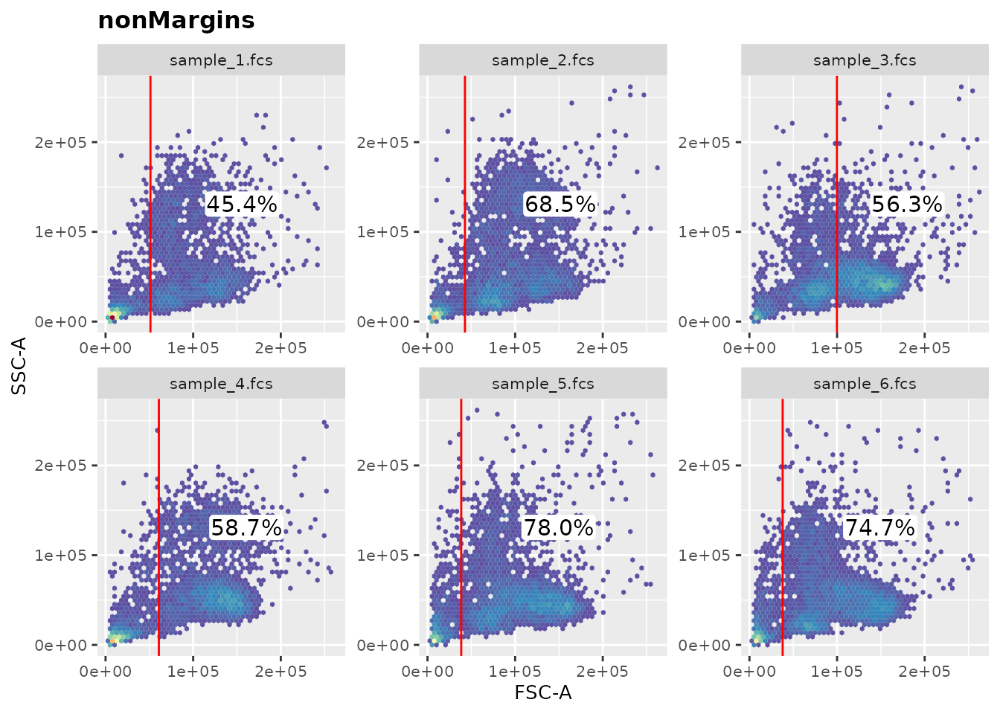

``` r


# singlets gate
plotAllSamples(gs1, "FSC-A", "FSC-H", "nonDebris", "singlets")
```

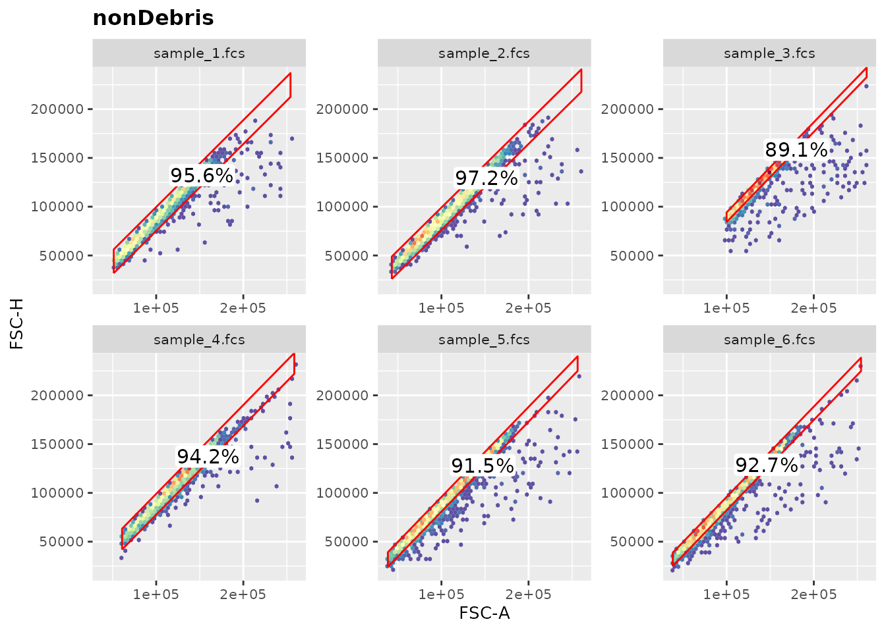

``` r


# live cell gate
plotAllSamples(gs1, !!enquo(ld_stain), "FSC-A", "singlets", "live")
```

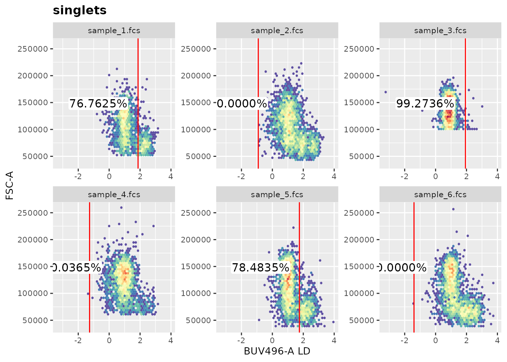

Here we see that the debris gate for the third sample is poorly placed,
and multiple gates for live/dead cells need adjustment. The algorithm
used to place gates for these populations, \`gate_mindensity’, works by
fitting a kernel density estimator to the data and finding the two
largest peaks. When only one peak is found, or a sample has a more
unique distribution, it may not perform as well without some additional
arguments. These gates may be fixed with a few different approaches.

The first is to adjust the `gatingTemplate`. In many cases, restricting
the range in which the gate can be drawn resolves this kind of issue. To
set a minimum and maximum value for a gate drawn by `gate_mindensity`,
edit the argument `gate_range`. Note that making changes to the
`gatingTemplate` does not immediately affect the `GatingSet` it was
applied to. First, the old gate(s) and any associated children must be
deleted within the `GatingSet` with
[`flowWorkspace::gs_pop_remove()`](https://rdrr.io/pkg/flowWorkspace/man/gs_pop_add.html)
(this does not delete the gates defined in the `gatingTemplate`). The
new `gatingTemplate` can then be applied with
[`openCyto::gatingTemplate()`](https://rdrr.io/pkg/openCyto/man/gatingTemplate-class.html)
and the deleted gates will be redrawn according to the adjustments. The
code below demonstrates this with the `data.table` created earlier, and
plots the new gates generated after applying the new gating scheme.

``` r

# Edit arguments of gate_mindensity
gt_table[2, "gating_args"] <- "gate_range=c(0,80000)" # Set range of debris gate to [0,80000]

# Remove gate(s) that will be redrawn
# Here we delete "nonDebris", which also deletes its children gates (singlets, live) 
flowWorkspace::gs_pop_remove(gs1, "nonDebris")

# Generate new gating template
gt <- openCyto::gatingTemplate(gt_table)

# Apply to data
openCyto::gt_gating(gt, gs1)

# Plot new nonDebris gates
plotAllSamples(gs1, "FSC-A", "SSC-A", "nonMargins", "nonDebris")
```

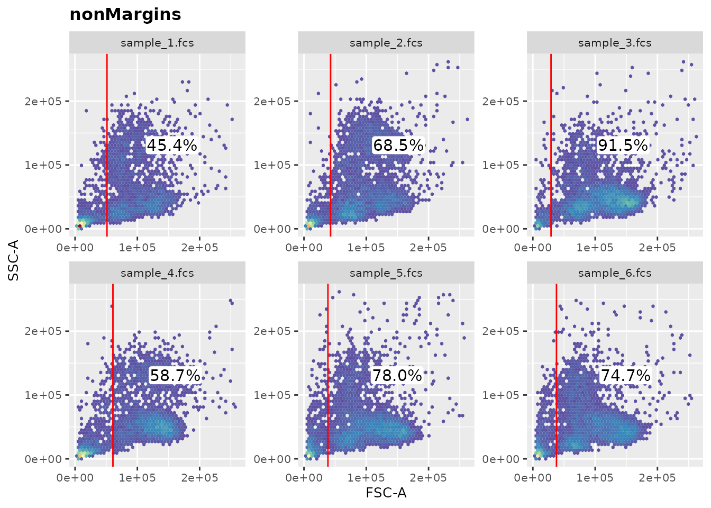

Another option is to draw gates with collapsed data, instead of
calculating them per sample. This approach is particularly helpful when
the data does not have many cells. It is also more straightforward,
since the same gate is applied to each sample. The code below
demonstrates this, and generates plots of the new gate for live cells.

``` r

# Get new gating table
gt_table <- generateGatingTable(gs1, collapse_data = TRUE, ld_stain)

# Remove gate(s) that will be redrawn
flowWorkspace::gs_pop_remove(gs1, "nonDebris")

# Generate new gating template
gt <- openCyto::gatingTemplate(gt_table)

# Apply to data
openCyto::gt_gating(gt, gs1)

# Plot new L/D gates
plotAllSamples(gs1, !!enquo(ld_stain), "FSC-A", "singlets", "live")
```

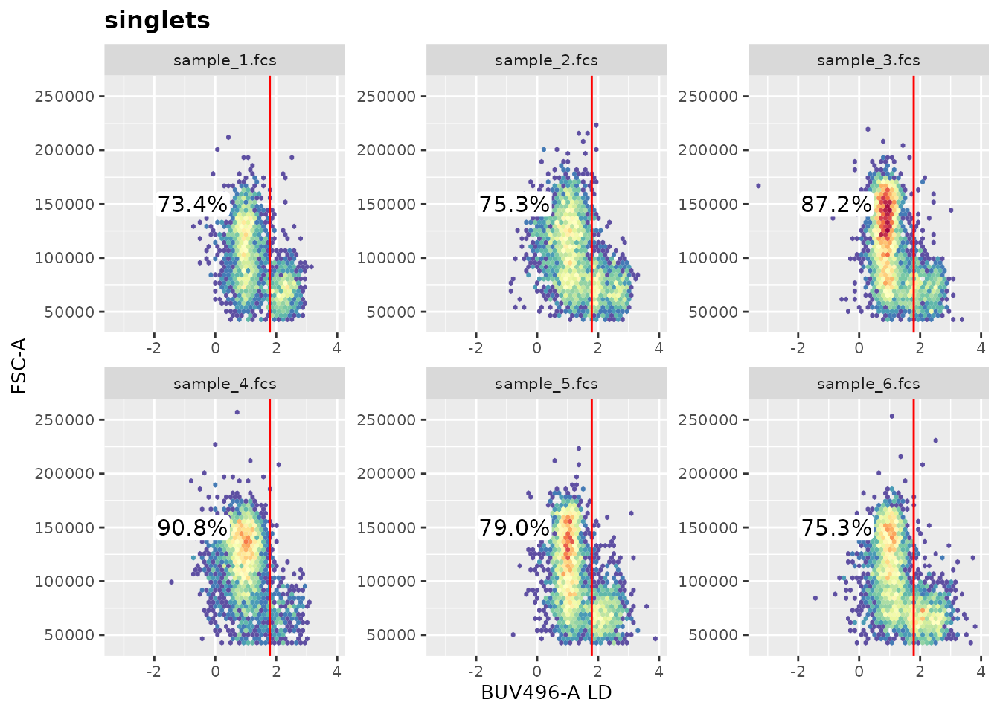

Finally, we may also adjust a gate by manually redrawing it. This can be
done with the function `editGateManual()`, which implements
`CytoExploreR::cyto_gate_draw()` for this pipeline. A window where the
user may draw a new gate on the sample(s) of interest is brought up, and
once the gate has been drawn, the given `GatingSet` is edited
accordingly. An example of how this function may be used is shown below,
where we choose to manually draw and replace the `"live_cells"` gate for
all samples with a rectangle gate. Other supported gate types are
polygon, ellipse, threshold, boundary, interval, quadrant, and web; see
`?CytoExploreR::cyto_gate_draw()` for more details.

``` r

### Edit gate for one sample:
# Check gate before:
autoplot(gs1[[3]])

# Example of a call to manually redraw gates; not run
editGateManual(gs1,
               node = "nonDebris", # name of population to redraw gates for
               gate_type = "rectangle", # type of gate to draw
               sample_ids = 1) # vector of sample indices to redraw gates for, default is NULL (all samples)
```

Once preprocessing results appear satisfactory, the user can either
export results to FlowJo using the `CytoML` package (note: this requires
Docker to be installed) or continue with this pipeline to cluster data.

It is recommended that the user saves their `GatingSet` before
continuing. Recall that the earlier preprocessing steps were performed
on a deep copy of the data to make edits more easily reversible, and
avoid accidentally changing the underlying data. At this point the
preprocessing steps are final, and so they should be saved so that
progress is not lost. To save a `GatingSet`, create a new folder in an
appropriate directory, then call
[`flowWorkspace::save_gs()`](https://rdrr.io/pkg/flowWorkspace/man/save_gs.html).
Note that more than one `GatingSet` may not be saved to the same
directory.

``` r

# Specify name of directory to save to
path <- file.path(getwd(), "gating_set")

# Make directory if it doesn't exist
dir.create(path)

# Save GatingSet
flowWorkspace::save_gs(gs1, path = path) # Set `path` to the name of your chosen directory
```

After saving the user may safely close their R session and return later,
if desired. To load a previously saved `GatingSet`, use
[`flowWorkspace::load_gs()`](https://rdrr.io/pkg/flowWorkspace/man/save_gs.html).
The only input necessary is the name of the folder the `GatingSet` was
saved to.

``` r

# Load saved GatingSet
flowWorkspace::load_gs(path)
```

## Clustering

This package is compatible with various clustering algorithms, but was
designed specifically with FlowSOM in mind due to its fast runtime and
tools for data visualization. Therefore, much focus will be given to
FlowSOM in the following section.

The strategy for identifying cell type populations outlined by this
workflow is not entirely automated, and instead uses a human-in-the-loop
approach. Such an approach aims to reduce the burden of analyzing such a
large volume of data, while still incorporating expert knowledge to
ensure that results are biologically meaningful. To accomplish this, the
data is initially overclustered. The expert then examines the result of
the clustering through various relevant plots, taking into account not
only marker expression but also cluster sizes and mathematical distance,
and uses their best judgement to merge clusters until an appropriate
final clustering has been reached and labelled.

It is also necessary for the user to specify which markers are to be
used for clustering. There are a few considerations to account for when
selecting these, the most important being that it is highly recommended
that any markers the user intends to test for differential expression
are NOT used for clustering. There is a number of reasons for this, but
in short, it generally makes little sense to test for differential
expression of a marker in a cluster when the cluster is defined by high
or low expression of said marker (i.e. testing for differential
expression of CD8 in CD8 T cells). Furthermore, parameters like side and
forward scatter should not be included, and if a viability stain was
used, it should also be excluded.

Below, the preprocessed data from earlier is clustered using the FlowSOM
algorithm via the function
[`flowSOMWrapper()`](https://00berst33.github.io/flowFun/reference/flowSOMWrapper.md).
This outputs the same table that is given to it, but with the columns
`Metacluster` and `Cluster` joined to the right, giving the results of
the clustering. Specifying a seed is optional, but strongly recommended
for the sake of reproducibility.

`FlowSOM()` does not take `GatingSet` data structures as input, so to
use this function users should subset their data to the appropriate
population with
[`gs_pop_get_data()`](https://rdrr.io/pkg/flowWorkspace/man/gh_pop_get_data.html)
and pass the result to
[`cytoset_to_flowSet()`](https://rdrr.io/pkg/flowWorkspace/man/convert.html).
This table may then be passed to
[`flowSOMWrapper()`](https://00berst33.github.io/flowFun/reference/flowSOMWrapper.md).

``` r

# Read in table
fs <- flowWorkspace::gs_pop_get_data(gs1, y = "live")
fs <- flowWorkspace::cytoset_to_flowSet(fs)

# Define markers/columns to use for clustering
cols_to_cluster <- c("BB700-P-A", "APC-A", "Alexa Fluor 700-A", "APC-Cy7-A", "BV480-A", 
                     "BV605-A", "BV650-A", "BV711-A", "BV750-P-A", "BV786-A", "BUV395-A", 
                     "BUV563-A", "BUV615-P-A", "BUV661-A", "BUV737-A", "BUV805-A", "PE-A",
                     "PE-CF594-A", "PE-Cy5-A", "PE-Cy7-A")

# Perform clustering
fsom_dt <- flowSOMWrapper(fs,
                          cols_to_cluster = cols_to_cluster,
                          num_clus = 25,
                          xdim = 12,
                          ydim = 12,
                          seed = 42)
```

| Metacluster | Cluster |
|:-----------:|:-------:|
|      8      |   66    |
|     25      |   138   |
|      3      |   23    |
|      6      |   35    |
|     10      |   85    |

A number of different plots may be generated by this package to aid the
user in merging metaclusters, but arguably the most important are
heatmaps and dimension reduction plots. Below, a heatmap of MFIs by
metacluster is generated.

``` r

# Generate heatmap
plotMetaclusterMFIs(fsom_dt)
```

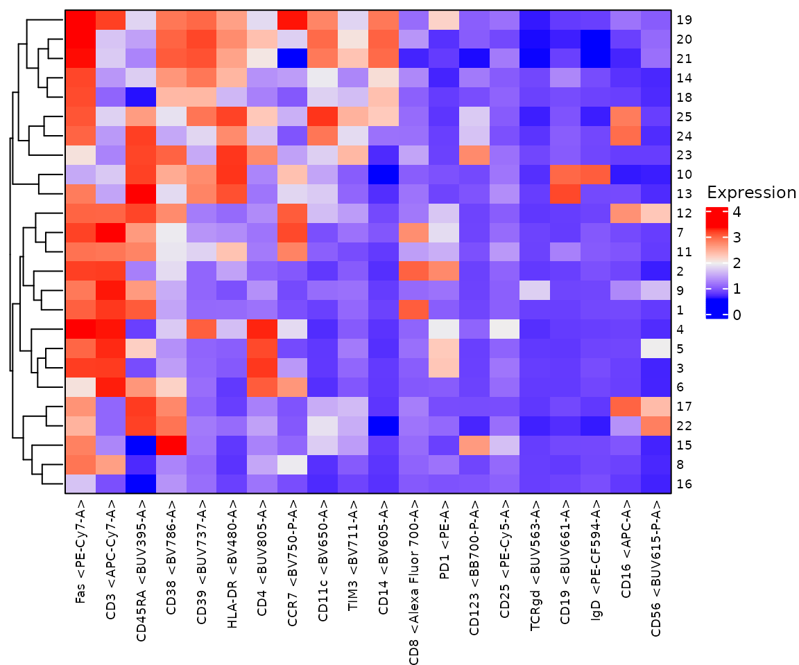

This heatmap is what the user should be using as their main reference
when merging metaclusters. The dendrogram on the left-hand side, which
displays a hierarchal clustering of the metaclusters, is of particular
interest, and this hierarchy may be followed to perform the clustering.
However, this dendrogram should not be followed blindly. First, the
metaclusters that are determined to be similar by the clustering may not
be of biological interest; some cell type markers may be of greater
significance than others, and this is something that the clustering does
not take into account. Second, dendrograms may be created with different
linkage methods (single-linkage, average-linkage, centroid-linkage,
etc.), and these different methods may result in slightly different
hierarchies. This is not to say that the dendrogram is useless, only
that it has its limitations.

The user should also consider cluster size when merging. If a
metacluster is rather small, and differs from its neighboring clusters
in irrelevant markers, then it is reasonable to merge it. However, if
the metacluster is small but distinct in markers of interest, it may be
left unmerged.

Finally, if a metacluster does not represent any particular cell type of
interest, it may be dropped from the analysis entirely. For example,
depending on how strict you were with your gating, there may be some
debris remaining in your preprocessed data. The clustering algorithm
will likely cluster these together, and you may decide to exclude them
from further analysis.

To further aid the decision making process, a UMAP colored by
metacluster is generated below.

``` r

# Generate UMAP
plotUMAP(fsom_dt, num_cells = 5000, seed = 42)
```

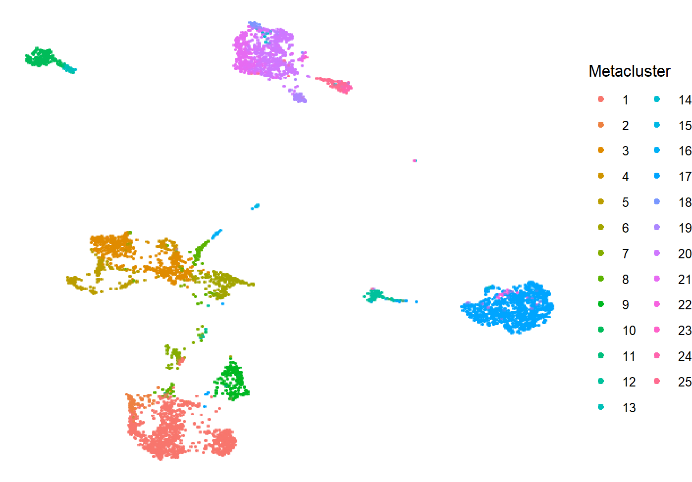

This plot is most useful to check metaclusters’ relative sizes, and how
similar they are to one another. The closer clusters (and cells) are to
each other, the more similar they are to each other. However, the
opposite is not necessarily true.

By examining these plots, it starts to become clear which metaclusters
are more similar to one another, and what their phenotype may be. For
example, we see that metaclusters 1, 2, and 7 are all somewhat closely
linked by the dendrogram in the heatmap, and are rather close to one
another in the UMAP. They all have a high expression of the markers CD3
and CD8, but differ noticeably in markers PD1, CCR7, and CD45RA. It
seems that these metaclusters are each a subset of CD8 T cells, and it
is reasonable to merge them. Depending on the question being
investigated, the user may wish to instead keep them separate, and
perhaps specify exhausted and non-exhausted CD8 T cells, which could
also be reasonable.

It should be noted that if a user does desire to look at a particular
cell type in greater resolution, this workflow allows for backgating on
and reclustering cells belonging to a particular metacluster; therefore
identifying every sub-population of interest is not necessary at this
step. For now, this example will find an initial low-resolution
clustering.

The function
[`editTableMetaclusters()`](https://00berst33.github.io/flowFun/reference/editTableMetaclusters.md)
can be used to merge and rename metaclusters. A new column,
`Meta_original`, is added to the given table, specifying the
metaclusters that were found when the clustering algorithm was first
called. The existing `Metaclusters` column is edited to contain the new
assignments.

``` r

# Merge metaclusters
fsom_dt <- editTableMetaclusters(fsom_dt, 
                                 new_labels = c("7" = "1",
                                                "2" = "1",
                                                "5" = "3",
                                                "4" = "3",
                                                "5" = "3",
                                                "6" = "3",
                                                "13" = "10",
                                                "22" = "17"))
```

| Meta_original | Metacluster | Cluster |
|:-------------:|:-----------:|:-------:|
|       8       |      8      |   66    |
|      25       |     25      |   138   |
|       3       |      3      |   23    |
|       6       |      3      |   35    |
|      10       |     10      |   85    |

A new heatmap may be generated to reflect the new clustering, and help
decide whether any further merging should be performed.

``` r

# Generate new heatmap
plotMetaclusterMFIs(fsom_dt, cols_to_cluster)
```

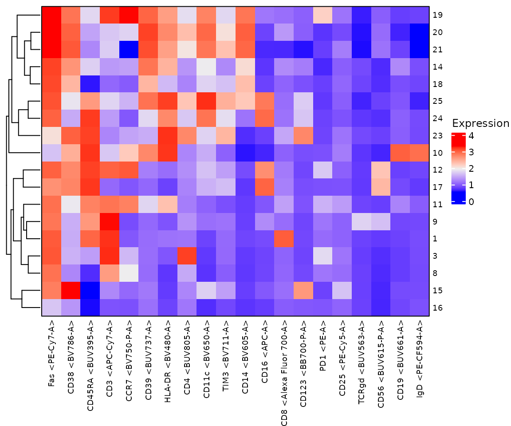

Examining this heatmap suggests that metacluster 9 may be a subset of
gdT cells, but the somewhat low expression of TCRgd makes it difficult
to determine this with much certainty. Sometimes, once the most obvious
merging has been done, UMAPs and MFI heatmaps alone are no longer
sufficient to make informed decisions. Two other notable functions are
provided to give further info about the clusters, the first being
[`plotClusterMFIs()`](https://00berst33.github.io/flowFun/reference/plotClusterMFIs.md).
It functions almost identically to
[`plotMetaclusterMFIs()`](https://00berst33.github.io/flowFun/reference/plotMetaclusterMFIs.md),
except that its rows are clusters, and it may be used to look at the
clusters within specific metacluster(s) of interest via the parameter
`metaclusters`. This is demonstrated below by calling the function on
metacluster 9.

``` r

# Generate cluster MFI heatmap
plotClusterMFIs(fsom_dt, cols_to_cluster, metaclusters = 9)
```

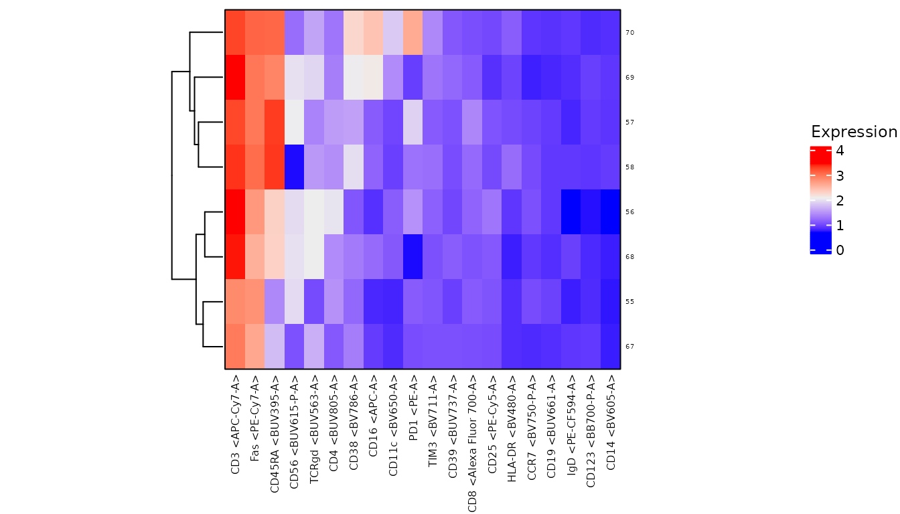

It seems that clusters 55, 57, 58, 69, and 70 have a particularly low
expression of TCRgd compared to other nodes in this metacluster. This
may be further investigated with the second notable function,
[`plotLabeled2DScatter()`](https://00berst33.github.io/flowFun/reference/plotLabeled2DScatter.md).
It creates a 2D scatterplot colored by metacluster, where each cluster
center is labeled with its cluster’s number. Below, this function is
called on these five clusters.

``` r

# Generate 2D scatterplot
plotLabeled2DScatter(fsom_dt, 
                     channelpair = c("APC-Cy7-A", "BUV563-A"), 
                     clusters = c(55, 57, 58, 69, 70),
                     metaclusters = NULL)
```

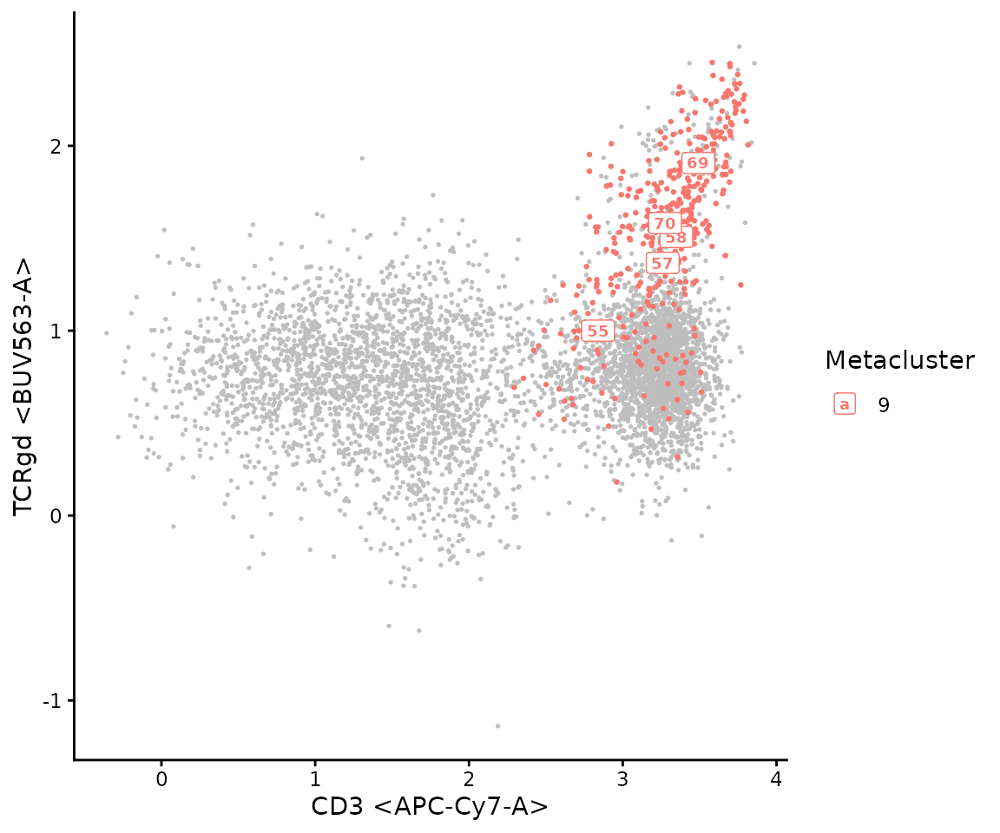

Cluster 55 clearly does not have a high enough expression of TCRgd to
justify classifying it as gdT cells. Additionally, although it has
appropriately high expression of TCRgd, cluster 70 also has high
expression of multiple unrelated phenotyping markers (as seen in the
heatmap), suggesting that it may be a population of cells that were
stuck together. In the next merging step performed below, these clusters
are reassigned to a new metacluster named `"Undefined"`. It is
recommended to avoid reassigning clusters as much as possible, as doing
so increases the subjectivity of the analysis, but it is ultimately up
to the user to determine when this step is appropriate.

``` r

# Merge metaclusters
fsom_dt <- editTableMetaclusters(fsom_dt,
                                 new_labels = c("19" = "14",
                                                "20" = "14",
                                                "21" = "14",
                                                "18" = "14",
                                                "25" = "14",
                                                "16" = "8",
                                                "11" = "8",
                                                "23" = "15"),
                                 cluster_assignments = c("55" = "Undefined",
                                                         "70" = "Undefined"))
```

Again, new plots are generated.

``` r

# New heatmap
plotMetaclusterMFIs(fsom_dt, cols_to_cluster)

# New UMAP
plotUMAP(fsom_dt, num_cells = 5000, seed = 42)
```

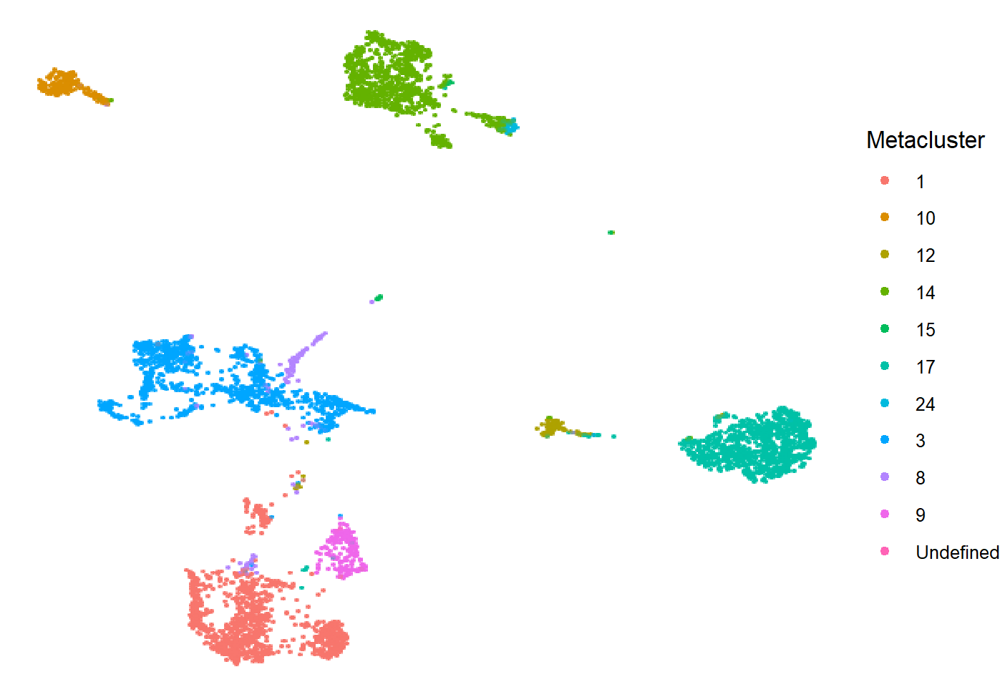

Finally, once the clustering is complete, the remaining metaclusters may
be labelled by setting each of them equal to the desired name, instead
of another metacluster to be merged into.

``` r

# Label metaclusters
fsom_dt <- editTableMetaclusters(fsom_dt, new_labels = c("14" = "Monocytes",
                                                         "24" = "cDC",
                                                         "10" = "B cells",
                                                         "12" = "NK T cells",
                                                         "17" = "NK cells",
                                                         "1" = "CD8 T cells",
                                                         "9" = "gdT cells",
                                                         "3" = "CD4 T cells",
                                                         "15" = "pDC",
                                                         "8" = "Undefined"))

# Generate final heatmap
plotMetaclusterMFIs(fsom_dt, cols_to_cluster)
```

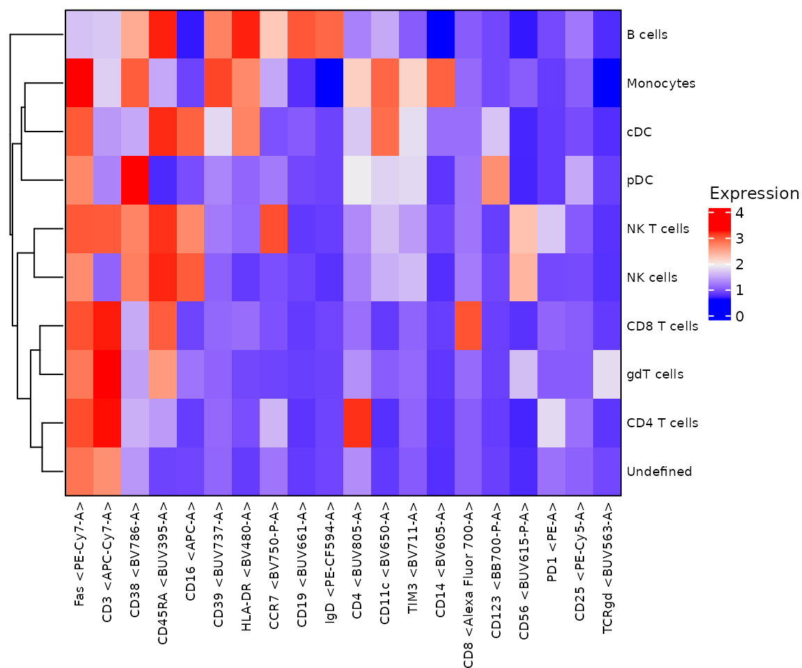

An annotated heatmap displaying the merged clusters may be created with
the function
[`annotateMFIHeatmap()`](https://00berst33.github.io/flowFun/reference/annotateMFIHeatmap.md).

``` r

# Generate annotated heatmap
annotateMFIHeatmap(fsom_dt, cols_to_cluster)
```

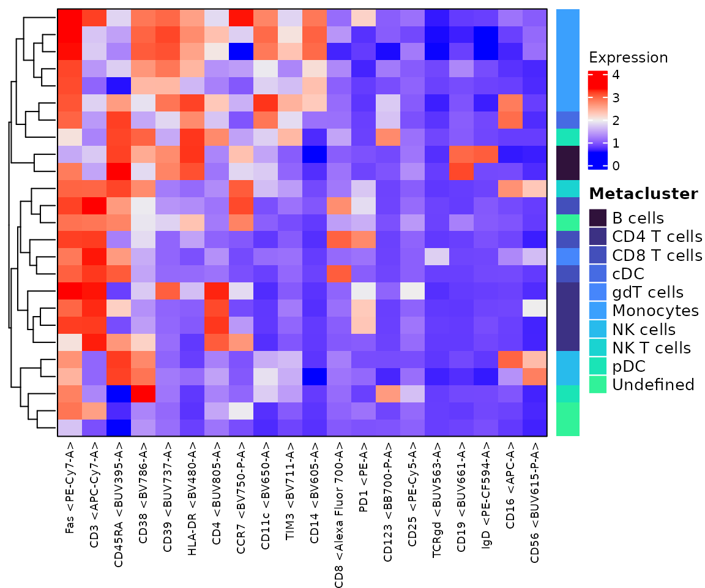

#### Saving results

The clustering results may now be saved to the `GatingSet` created
during preprocessing, as a set of boolean gates. This step is
implemented by the function
[`addClustersToGatingSet()`](https://00berst33.github.io/flowFun/reference/addClustersToGatingSet.md),
which needs only three inputs: the `data.table` resulting from the
clustering step, the `GatingSet` whose expression data was used for
clustering, and the name of the population/gate in the `GatingSet` to
add these new gates to.

To see the gates that are currently in a `GatingSet`, the user can use
the
[`gs_get_pop_paths()`](https://rdrr.io/pkg/flowWorkspace/man/gs_get_pop_paths.html)
function.

``` r

# See all populations in GatingSet
flowWorkspace::gs_get_pop_paths(gs1)
#> [1] "root"                                "/nonMargins"                        
#> [3] "/nonMargins/nonDebris"               "/nonMargins/nonDebris/singlets"     
#> [5] "/nonMargins/nonDebris/singlets/live"
```

Note that the function `openCyto::plot()` used above to visualize the
`gatingTemplate` may also be used on a `GatingSet` or `GatingHierarchy`
object, and may be helpful in determining the appropriate parent
population.

Once the parent population has been determined, the new gates may be
added with
[`addClustersToGatingSet()`](https://00berst33.github.io/flowFun/reference/addClustersToGatingSet.md).
Because `GatingSet` is a reference class, only the underlying data is
edited and so there is no object returned from the function.

We visualize the results with `openCyto::plot()`:

``` r

# Add clusters to GatingSet
addClustersToGatingSet(fsom_dt, gs1, parent_gate = "live")

# Visualize new gating template
openCyto::plot(gs1)
```

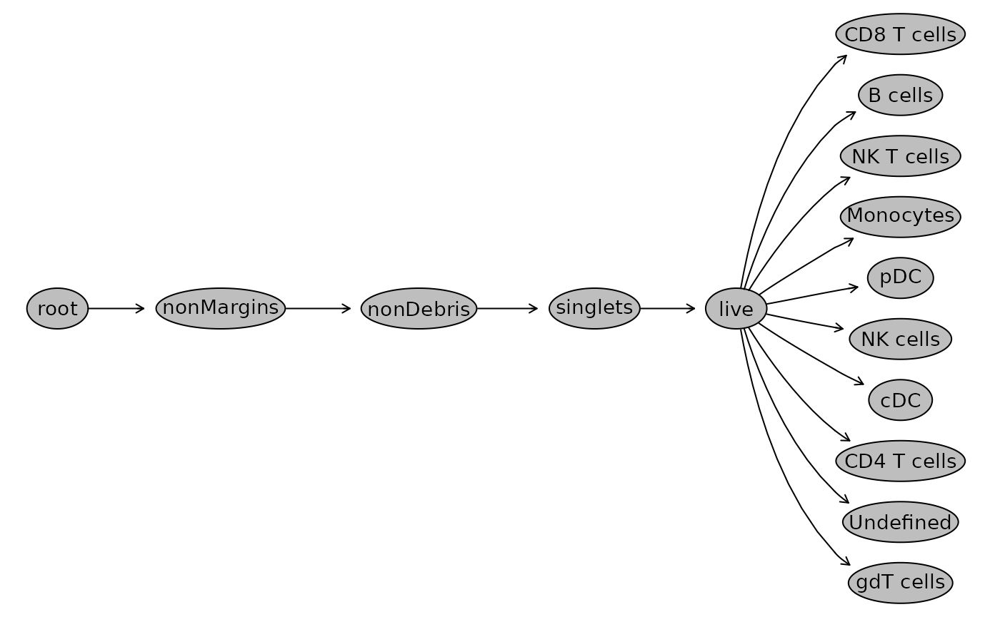

Each cluster created earlier is now saved in the `GatingSet`. This is
convenient for several reasons. First, it allows for swift and easy
subsetting of the `GatingSet` by any combination of clusters. Any
function compatible with the `cytoset` or `flowSet` becomes available
for these subsets; in the below example the function
[`flowWorkspace::gs_pop_get_count_fast()`](https://rdrr.io/pkg/flowWorkspace/man/gs_pop_get_count_fast.html)
is used to get frequencies of CD4 T cells and CD8 T cells in each
sample.

``` r

# Get only CD8 and CD4 T cells in GatingSet
flowWorkspace::gs_pop_get_count_fast(gs1, 
                                     subpopulations = c("/nonMargins/nonDebris/singlets/live/CD8 T cells", 
                                                        "/nonMargins/nonDebris/singlets/live/CD4 T cells"), 
                                     statistic = "freq", 
                                     format = "long")
#>             name                                      Population
#>           <char>                                          <char>
#>  1: sample_1.fcs /nonMargins/nonDebris/singlets/live/CD8 T cells
#>  2: sample_1.fcs /nonMargins/nonDebris/singlets/live/CD4 T cells
#>  3: sample_2.fcs /nonMargins/nonDebris/singlets/live/CD8 T cells
#>  4: sample_2.fcs /nonMargins/nonDebris/singlets/live/CD4 T cells
#>  5: sample_3.fcs /nonMargins/nonDebris/singlets/live/CD8 T cells
#>  6: sample_3.fcs /nonMargins/nonDebris/singlets/live/CD4 T cells
#>  7: sample_4.fcs /nonMargins/nonDebris/singlets/live/CD8 T cells
#>  8: sample_4.fcs /nonMargins/nonDebris/singlets/live/CD4 T cells
#>  9: sample_5.fcs /nonMargins/nonDebris/singlets/live/CD8 T cells
#> 10: sample_5.fcs /nonMargins/nonDebris/singlets/live/CD4 T cells
#> 11: sample_6.fcs /nonMargins/nonDebris/singlets/live/CD8 T cells
#> 12: sample_6.fcs /nonMargins/nonDebris/singlets/live/CD4 T cells
#>                                  Parent Frequency ParentFrequency
#>                                  <char>     <num>           <num>
#>  1: /nonMargins/nonDebris/singlets/live    0.0106          0.3138
#>  2: /nonMargins/nonDebris/singlets/live    0.0690          0.3138
#>  3: /nonMargins/nonDebris/singlets/live    0.0124          0.4768
#>  4: /nonMargins/nonDebris/singlets/live    0.0646          0.4768
#>  5: /nonMargins/nonDebris/singlets/live    0.1206          0.7378
#>  6: /nonMargins/nonDebris/singlets/live    0.1354          0.7378
#>  7: /nonMargins/nonDebris/singlets/live    0.2000          0.5032
#>  8: /nonMargins/nonDebris/singlets/live    0.1028          0.5032
#>  9: /nonMargins/nonDebris/singlets/live    0.1612          0.5550
#> 10: /nonMargins/nonDebris/singlets/live    0.1356          0.5550
#> 11: /nonMargins/nonDebris/singlets/live    0.1962          0.5216
#> 12: /nonMargins/nonDebris/singlets/live    0.1358          0.5216
```

It is also simple to extract a subset of data using one of these gates,
and use it to write new FCS files. For example:

``` r

# Get cytoset for population of interest
cs_subset <- flowWorkspace::gs_pop_get_data(gs1, y = "NK cells")

# Make flowSet
fs <- flowWorkspace::cytoset_to_flowSet(cs_subset)

# Write new FCS files to disk
flowCore::write.flowSet(fs, outdir = getwd())
```

Recall that the `GatingSet` includes compensations, transformations,
sample information, metadata, and gating schemes in addition to the
expression data. The goal is to keep all relevant information about the
experiment and its analysis neatly contained within one lightweight
object, so that once it has been created, all that is necessary to
resume analysis is a call to
[`flowWorkspace::load_gs()`](https://rdrr.io/pkg/flowWorkspace/man/save_gs.html).

This feature is especially useful when performing a reclustering of the
data, or applying control stains, which will be demonstrated further
below.

#### Reclustering

This script also allows the user to perform backgating and reclustering
on any identified cell types of particular interest. This clustering may
be done using either a selected number of principal components obtained
from PCA, or a new subset of markers defined by the user. The former
approach is demonstrated below to further investigate the cells
identified as CD8 T cells.

``` r

# Get table of only CD8 T cells
new_table <- createFilteredAggregate(fsom_dt, 
                                     num_cells = Inf, 
                                     metaclusters = "CD8 T cells",
                                     clusters = NULL)
#> [1] "sample_1.fcs" "sample_2.fcs" "sample_3.fcs" "sample_4.fcs" "sample_5.fcs"
#> [6] "sample_6.fcs"
```

One an appropriate subset has been created, the next step is to create a
scree plot, which may be used to determine which principal components
should be used in the analysis. Typically, there is a distinct “elbow”
in the plot, where the amount of variance explained by each component
becomes drastically smaller. So, if this elbow appears at principal
component 5, components 1-5 would be selected to recluster the data. If
there is no obvious elbow, it is instead reasonable to use whichever
number of components explains roughly 70-80% of the variance. First,
[`doPCA()`](https://00berst33.github.io/flowFun/reference/doPCA.md) is
called to perform PCA. Then,
[`plotPCAScree()`](https://00berst33.github.io/flowFun/reference/plotPCAScree.md)
creates the scree plot.

``` r

# Perform PCA
pca_obj <- doPCA(new_table, cols_to_cluster)

# Draw scree plot
plotPCAScree(pca_obj)
```

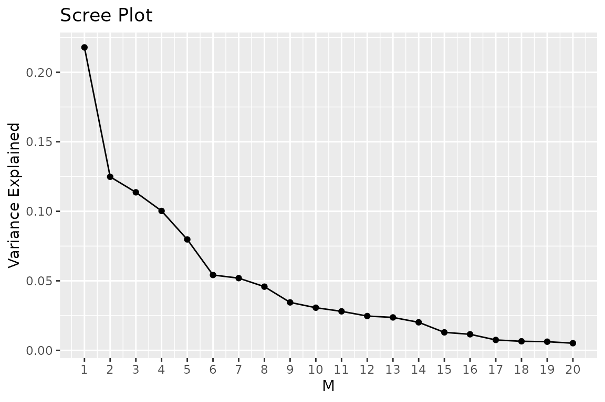

Here, there appears to be a fairly distinct elbow at `M = 6`. To
recluster using these principal components, the following call to
[`clusterSubsetWithPCA()`](https://00berst33.github.io/flowFun/reference/clusterSubsetWithPCA.md)
is made, with `num_components = 6`. Fewer metaclusters are created than
in the initial clustering, as fewer cell types are expected.

``` r

# Recluster CD8 T cells
fsom_sub <- clusterSubsetWithPCA(new_table, 
                                 pca_obj = pca_obj, 
                                 num_components = 6,
                                 num_clus = 15,
                                 seed = 33)
```

Note that the plot functions demonstrated earlier function the same for
any subsets created. Since the current cells of interest are CD8 T
cells, it is appropriate to define a new subset of markers to create the
heatmap.

``` r

# Define new columns to use
# cols_of_interest <- c(15, 16, 18, 23:25, 28, 32)
cols_of_interest <- c("APC-Cy7-A", "Alexa Fluor 700-A", "BUV395-A", "BV750-P-A", "PE-A", "BV786-A", "BV480-A", "BUV615-P-A")

# Generate heatmap for subsetted cells
plotMetaclusterMFIs(fsom_sub, cols_of_interest)

# Likewise, generate UMAP
plotUMAP(fsom_sub, num_cells = 5000, seed = 33)
```

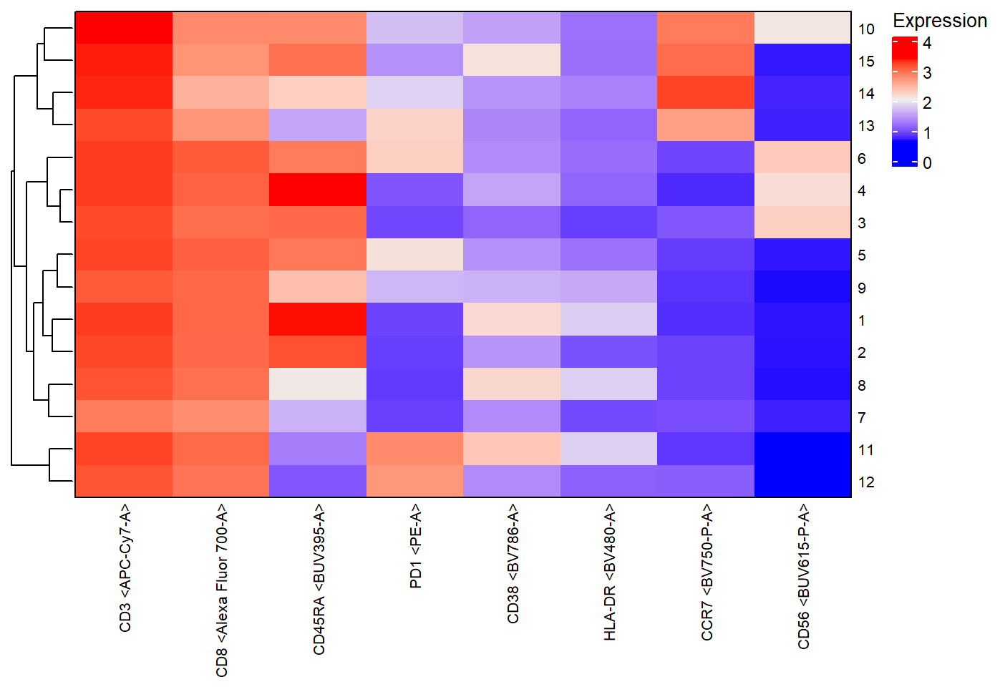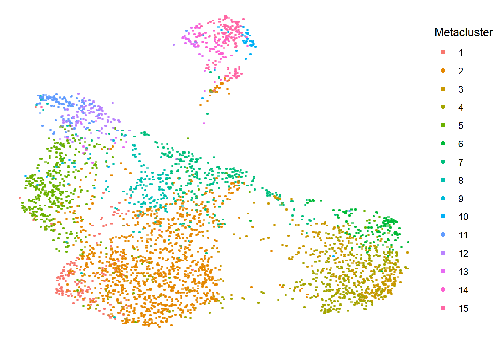

As with the parent population above, metaclusters are merged.

``` r

fsom_sub <- editTableMetaclusters(fsom_sub, new_labels = c("1" = "CD45RA+, CCR7-",
                                                           "2" = "CD45RA+, CCR7-",
                                                           "3" = "CD45RA+, CCR7-",
                                                           "4" = "CD45RA+, CCR7-",
                                                           "5" = "CD45RA+, CCR7-",
                                                           "6" = "CD45RA+, CCR7-",
                                                           "7" = "CD45RA-, CCR7-",
                                                           "8" = "CD45RA+, CCR7-",
                                                           "9" = "CD45RA+, CCR7-",
                                                           "10" = "CD45RA+, CCR7+",
                                                           "11" = "CD45RA-, CCR7-",
                                                           "12" = "CD45RA-, CCR7-",
                                                           "13" = "CD45RA-, CCR7+",
                                                           "14" = "CD45RA+, CCR7+",
                                                           "15" = "CD45RA+, CCR7+"))

# Generate heatmap for subsetted cells
plotMetaclusterMFIs(fsom_sub, cols_of_interest)
```

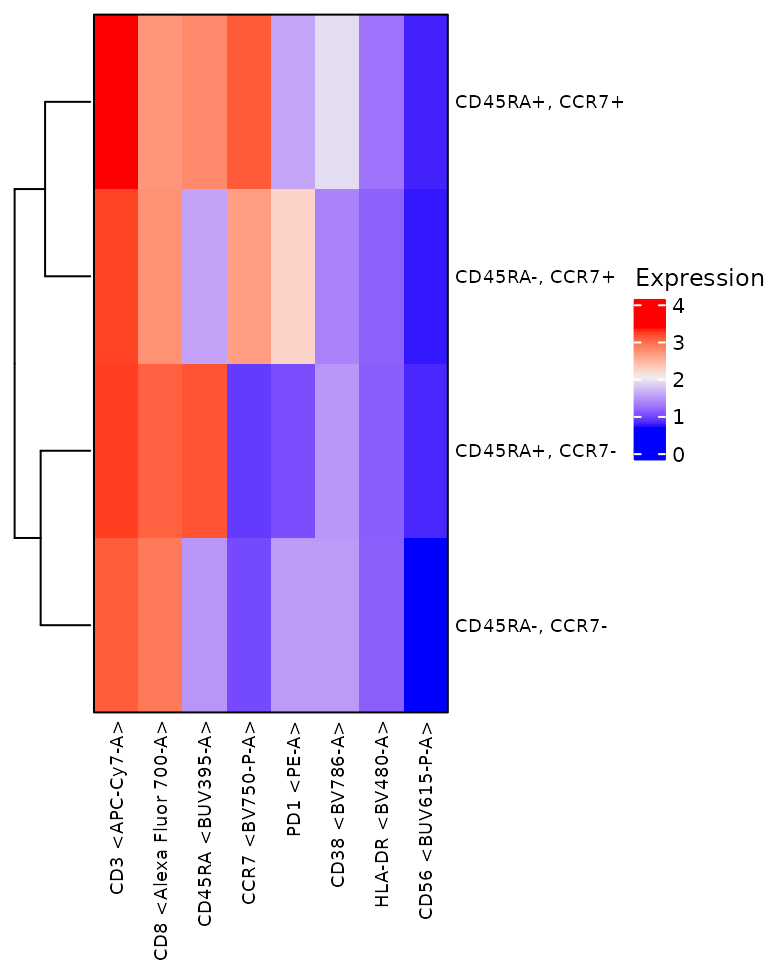

If desired, the clusters found in this subset may overwrite their parent
cluster in the `data.table` used for the initial clustering. Meaning, in
this case, any cells previously labeled as `"CD8 T cells"` will instead
be labelled with the more specific cell type found in the reclustering
above. New heatmaps and dimension reduction plots with the updated
labels may then be generated.

The function
[`overwriteMetaclusterNames()`](https://00berst33.github.io/flowFun/reference/overwriteMetaclusterNames.md)
performs this operation. The code chunk below demonstrates this and
generates a new heatmap.

``` r

# Overwrite labels for CD8 T cells with those found in reclustering
fsom_over <- overwriteMetaclusterNames(fsom_dt, fsom_sub)

# Generate new UMAP
# should minimum cell count per cluster be enforced?
plotUMAP(fsom_over, num_cells = 5000, seed = 42)
```

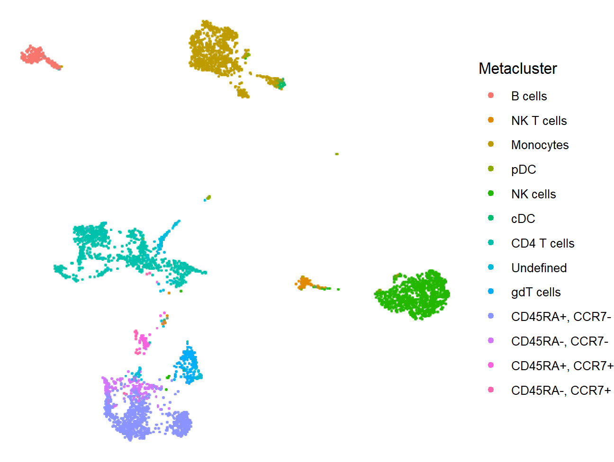

The finalized populations may also be saved to the `GatingSet`. In this
case, we have a reclustering of the CD8 T cell population, so we call
[`addClustersToGatingSet()`](https://00berst33.github.io/flowFun/reference/addClustersToGatingSet.md)
with `parent_gate = "CD8 T cells"`.

``` r

# Add clusters to GatingSet
addClustersToGatingSet(fsom_sub, gs1, parent_gate = "CD8 T cells")

# Visualize new gating template
openCyto::plot(gs1)
```

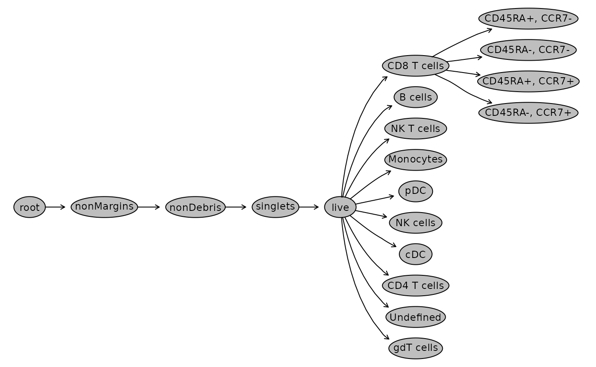

The resulting plot shows each cluster defined so far, and any
parent-child relationships.

## Differential Analysis

The final analysis step in this workflow is differential analysis.
Differential marker expression is implemented using limma, and
differential count analysis using edgeR, both R packages found on
Bioconductor.

Some preparation is necessary before any tests can be performed. First,
it is necessary to specify information about each sample, including any
FMO or isotype controls, and which groups of interest it belongs to
(e.g. control vs. treatment). This information may be provided as a .csv
file or `data.frame` to the function
[`prepareSampleInfo()`](https://00berst33.github.io/flowFun/reference/prepareSampleInfo.md),
which will prepare the table for further use by the workflow and ensure
that its values are R-friendly (no special characters like @ or \#, no
empty values, etc.). Below is an example of what an appropriate .csv
file might look like.

|   filename   | sample.name | disease |  NAC   |       FMO        |     Isotype      |
|:------------:|:-----------:|:-------:|:------:|:----------------:|:----------------:|
| sample_1.fcs |   Ctrl 1    |  Ctrl   |        | FMO_sample_1.fcs | Iso_sample_1.fcs |
| sample_2.fcs |   Ctrl 2    |  Ctrl   |        | FMO_sample_2.fcs | Iso_sample_2.fcs |
| sample_3.fcs |   MIBC 3    |  MIBC   | No NAC | FMO_sample_3.fcs | Iso_sample_3.fcs |
| sample_4.fcs |   MIBC 4    |  MIBC   | No NAC | FMO_sample_4.fcs | Iso_sample_4.fcs |
| sample_5.fcs |   MIBC 5    |  MIBC   |  NAC   | FMO_sample_5.fcs | Iso_sample_5.fcs |
| sample_6.fcs |   MIBC 6    |  MIBC   |  NAC   | FMO_sample_6.fcs | Iso_sample_6.fcs |

Before calling
[`prepareSampleInfo()`](https://00berst33.github.io/flowFun/reference/prepareSampleInfo.md),
the user must also specify the comparisons they wish to make between
groups, as a series of nested lists. Each nested list should include at
least two levels of a factor to be used for the comparison. Each
comparison may be named however the user desires, given that it is
R-friendly. Below, two comparisons, `ctrl_vs_mibc` and `nac_vs_no_nac`
are defined.

``` r

comparisons <- list(
  ctrl_vs_mibc = list(disease = list("MIBC", "Ctrl")),
  nac_vs_no_nac = list(disease = "MIBC", NAC = list("NAC", "No.NAC"))
)
```

The factor names (which would be “disease” and “NAC” in the above
example), unlike the names of comparisons, should be identical to their
column names in the .csv file or data frame given to
[`prepareSampleInfo()`](https://00berst33.github.io/flowFun/reference/prepareSampleInfo.md).
Similarly, the factor levels (which would be “Ctrl”, “MIBC”, “NAC”, and
“No NAC” in the above example), should be listed identical to how they
appear in the data frame. Note how these values match those present in
the table just shown.

Once these two items have been specified, the remainder of analysis is
rather straightforward.
[`prepareSampleInfo()`](https://00berst33.github.io/flowFun/reference/prepareSampleInfo.md)
is called, formatting the given table as necessary, and adding a new
column called `group`.

``` r

# Get filepath
file <- system.file("extdata", "sample_info.csv", package = "flowFunData")

# Prepare metadata for further analysis
sample_info <- prepareSampleInfo(file, 
                                 name_col = "sample.name",
                                 filename_col = "filename",
                                 comparisons = comparisons)
```

| sample.name | filename | disease | NAC | FMO | Isotype | group |
|:--:|:--:|:--:|:--:|:--:|:--:|:--:|
| Ctrl 1 | sample_1.fcs | Ctrl | X | FMO_sample_1.fcs | Iso_sample_1.fcs | Ctrl_X |
| Ctrl 2 | sample_2.fcs | Ctrl | X | FMO_sample_2.fcs | Iso_sample_2.fcs | Ctrl_X |
| MIBC 3 | sample_3.fcs | MIBC | No.NAC | FMO_sample_3.fcs | Iso_sample_3.fcs | MIBC_No.NAC |
| MIBC 4 | sample_4.fcs | MIBC | No.NAC | FMO_sample_4.fcs | Iso_sample_4.fcs | MIBC_No.NAC |
| MIBC 5 | sample_5.fcs | MIBC | NAC | FMO_sample_5.fcs | Iso_sample_5.fcs | MIBC_NAC |
| MIBC 6 | sample_6.fcs | MIBC | NAC | FMO_sample_6.fcs | Iso_sample_6.fcs | MIBC_NAC |

Next, the design, contrasts, and count matrices are created. The current
population of interest (in this case, `fsom_dt`) should be given to
[`makeCountMatrix()`](https://00berst33.github.io/flowFun/reference/makeCountMatrix.md).
Furthermore, the parameter `meta_names` should be used to specify the
metaclusters to use for analysis. By default, all metaclusters are
included, but if the final merging included an undefined metacluster, or
some are of no interest, it is useful to specify this parameter.

``` r

# Generate design matrix
design <- makeDesignMatrix(sample_info)

# Generate contrasts matrix
contrasts <- makeContrastsMatrix(sample_info, comparisons)

# Generate matrix of sample/metacluster cell counts
counts <- makeCountMatrix(fsom_dt, 
                          min_cells = 3, 
                          min_samples = 4)
```

The table of counts is printed below:

|  | sample_1.fcs | sample_2.fcs | sample_3.fcs | sample_4.fcs | sample_5.fcs | sample_6.fcs |
|:---|:--:|:--:|:--:|:--:|:--:|:--:|
| CD8 T cells | 53 | 62 | 603 | 1000 | 806 | 981 |
| B cells | 176 | 246 | 80 | 54 | 140 | 167 |
| NK T cells | 26 | 82 | 185 | 14 | 51 | 19 |
| Monocytes | 450 | 961 | 376 | 498 | 278 | 427 |
| pDC | 56 | 18 | 23 | 28 | 20 | 15 |
| NK cells | 261 | 615 | 1117 | 234 | 675 | 246 |
| cDC | 24 | 19 | 24 | 29 | 20 | 27 |
| CD4 T cells | 345 | 323 | 677 | 514 | 678 | 679 |
| Undefined | 165 | 48 | 208 | 96 | 43 | 33 |
| gdT cells | 13 | 10 | 396 | 49 | 64 | 14 |

To instead get counts from a `GatingSet`, the function
[`flowWorkspace::gs_pop_get_count_fast()`](https://rdrr.io/pkg/flowWorkspace/man/gs_pop_get_count_fast.html)
with argument `format` set to `"wide"` can also quickly obtain a count
matrix in the necessary format.

``` r

# Get counts from GatingSet
gs_counts <- flowWorkspace::gs_pop_get_count_fast(gs1, format = "wide") 
gs_counts
#>                                                                sample_1.fcs
#> /nonMargins                                                            4971
#> /nonMargins/nonDebris                                                  2338
#> /nonMargins/nonDebris/singlets                                         2138
#> /nonMargins/nonDebris/singlets/live                                    1569
#> /nonMargins/nonDebris/singlets/live/B cells                             176
#> /nonMargins/nonDebris/singlets/live/CD4 T cells                         345
#> /nonMargins/nonDebris/singlets/live/CD8 T cells                          53
#> /nonMargins/nonDebris/singlets/live/CD8 T cells/CD45RA+, CCR7+            9
#> /nonMargins/nonDebris/singlets/live/CD8 T cells/CD45RA+, CCR7-           20
#> /nonMargins/nonDebris/singlets/live/CD8 T cells/CD45RA-, CCR7+            3
#> /nonMargins/nonDebris/singlets/live/CD8 T cells/CD45RA-, CCR7-           21
#> /nonMargins/nonDebris/singlets/live/Monocytes                           450
#> /nonMargins/nonDebris/singlets/live/NK T cells                           26
#> /nonMargins/nonDebris/singlets/live/NK cells                            261
#> /nonMargins/nonDebris/singlets/live/Undefined                           165
#> /nonMargins/nonDebris/singlets/live/cDC                                  24
#> /nonMargins/nonDebris/singlets/live/gdT cells                            13
#> /nonMargins/nonDebris/singlets/live/pDC                                  56
#> root                                                                   5000
#>                                                                sample_2.fcs
#> /nonMargins                                                            4971
#> /nonMargins/nonDebris                                                  3411
#> /nonMargins/nonDebris/singlets                                         3164
#> /nonMargins/nonDebris/singlets/live                                    2384
#> /nonMargins/nonDebris/singlets/live/B cells                             246
#> /nonMargins/nonDebris/singlets/live/CD4 T cells                         323
#> /nonMargins/nonDebris/singlets/live/CD8 T cells                          62
#> /nonMargins/nonDebris/singlets/live/CD8 T cells/CD45RA+, CCR7+           18
#> /nonMargins/nonDebris/singlets/live/CD8 T cells/CD45RA+, CCR7-           26
#> /nonMargins/nonDebris/singlets/live/CD8 T cells/CD45RA-, CCR7+            3
#> /nonMargins/nonDebris/singlets/live/CD8 T cells/CD45RA-, CCR7-           15
#> /nonMargins/nonDebris/singlets/live/Monocytes                           961
#> /nonMargins/nonDebris/singlets/live/NK T cells                           82
#> /nonMargins/nonDebris/singlets/live/NK cells                            615
#> /nonMargins/nonDebris/singlets/live/Undefined                            48
#> /nonMargins/nonDebris/singlets/live/cDC                                  19
#> /nonMargins/nonDebris/singlets/live/gdT cells                            10
#> /nonMargins/nonDebris/singlets/live/pDC                                  18
#> root                                                                   5000
#>                                                                sample_3.fcs
#> /nonMargins                                                            4943
#> /nonMargins/nonDebris                                                  4438
#> /nonMargins/nonDebris/singlets                                         4230
#> /nonMargins/nonDebris/singlets/live                                    3689
#> /nonMargins/nonDebris/singlets/live/B cells                              80
#> /nonMargins/nonDebris/singlets/live/CD4 T cells                         677
#> /nonMargins/nonDebris/singlets/live/CD8 T cells                         603
#> /nonMargins/nonDebris/singlets/live/CD8 T cells/CD45RA+, CCR7+           62
#> /nonMargins/nonDebris/singlets/live/CD8 T cells/CD45RA+, CCR7-          388
#> /nonMargins/nonDebris/singlets/live/CD8 T cells/CD45RA-, CCR7+           16
#> /nonMargins/nonDebris/singlets/live/CD8 T cells/CD45RA-, CCR7-          137
#> /nonMargins/nonDebris/singlets/live/Monocytes                           376
#> /nonMargins/nonDebris/singlets/live/NK T cells                          185
#> /nonMargins/nonDebris/singlets/live/NK cells                           1117
#> /nonMargins/nonDebris/singlets/live/Undefined                           208
#> /nonMargins/nonDebris/singlets/live/cDC                                  24
#> /nonMargins/nonDebris/singlets/live/gdT cells                           396
#> /nonMargins/nonDebris/singlets/live/pDC                                  23
#> root                                                                   5000
#>                                                                sample_4.fcs
#> /nonMargins                                                            4961
#> /nonMargins/nonDebris                                                  3077
#> /nonMargins/nonDebris/singlets                                         2770
#> /nonMargins/nonDebris/singlets/live                                    2516
#> /nonMargins/nonDebris/singlets/live/B cells                              54
#> /nonMargins/nonDebris/singlets/live/CD4 T cells                         514
#> /nonMargins/nonDebris/singlets/live/CD8 T cells                        1000
#> /nonMargins/nonDebris/singlets/live/CD8 T cells/CD45RA+, CCR7+           43
#> /nonMargins/nonDebris/singlets/live/CD8 T cells/CD45RA+, CCR7-          870
#> /nonMargins/nonDebris/singlets/live/CD8 T cells/CD45RA-, CCR7+            6
#> /nonMargins/nonDebris/singlets/live/CD8 T cells/CD45RA-, CCR7-           81
#> /nonMargins/nonDebris/singlets/live/Monocytes                           498
#> /nonMargins/nonDebris/singlets/live/NK T cells                           14
#> /nonMargins/nonDebris/singlets/live/NK cells                            234
#> /nonMargins/nonDebris/singlets/live/Undefined                            96
#> /nonMargins/nonDebris/singlets/live/cDC                                  29
#> /nonMargins/nonDebris/singlets/live/gdT cells                            49
#> /nonMargins/nonDebris/singlets/live/pDC                                  28
#> root                                                                   5000
#>                                                                sample_5.fcs
#> /nonMargins                                                            4896
#> /nonMargins/nonDebris                                                  3791
#> /nonMargins/nonDebris/singlets                                         3513
#> /nonMargins/nonDebris/singlets/live                                    2775
#> /nonMargins/nonDebris/singlets/live/B cells                             140
#> /nonMargins/nonDebris/singlets/live/CD4 T cells                         678
#> /nonMargins/nonDebris/singlets/live/CD8 T cells                         806
#> /nonMargins/nonDebris/singlets/live/CD8 T cells/CD45RA+, CCR7+           51
#> /nonMargins/nonDebris/singlets/live/CD8 T cells/CD45RA+, CCR7-          554
#> /nonMargins/nonDebris/singlets/live/CD8 T cells/CD45RA-, CCR7+           13
#> /nonMargins/nonDebris/singlets/live/CD8 T cells/CD45RA-, CCR7-          188
#> /nonMargins/nonDebris/singlets/live/Monocytes                           278
#> /nonMargins/nonDebris/singlets/live/NK T cells                           51
#> /nonMargins/nonDebris/singlets/live/NK cells                            675
#> /nonMargins/nonDebris/singlets/live/Undefined                            43
#> /nonMargins/nonDebris/singlets/live/cDC                                  20
#> /nonMargins/nonDebris/singlets/live/gdT cells                            64
#> /nonMargins/nonDebris/singlets/live/pDC                                  20
#> root                                                                   5000
#>                                                                sample_6.fcs
#> /nonMargins                                                            4922
#> /nonMargins/nonDebris                                                  3648
#> /nonMargins/nonDebris/singlets                                         3464
#> /nonMargins/nonDebris/singlets/live                                    2608
#> /nonMargins/nonDebris/singlets/live/B cells                             167
#> /nonMargins/nonDebris/singlets/live/CD4 T cells                         679
#> /nonMargins/nonDebris/singlets/live/CD8 T cells                         981
#> /nonMargins/nonDebris/singlets/live/CD8 T cells/CD45RA+, CCR7+           60
#> /nonMargins/nonDebris/singlets/live/CD8 T cells/CD45RA+, CCR7-          879
#> /nonMargins/nonDebris/singlets/live/CD8 T cells/CD45RA-, CCR7+            7
#> /nonMargins/nonDebris/singlets/live/CD8 T cells/CD45RA-, CCR7-           35
#> /nonMargins/nonDebris/singlets/live/Monocytes                           427
#> /nonMargins/nonDebris/singlets/live/NK T cells                           19
#> /nonMargins/nonDebris/singlets/live/NK cells                            246
#> /nonMargins/nonDebris/singlets/live/Undefined                            33
#> /nonMargins/nonDebris/singlets/live/cDC                                  27
#> /nonMargins/nonDebris/singlets/live/gdT cells                            14
#> /nonMargins/nonDebris/singlets/live/pDC                                  15
#> root                                                                   5000
```

By default, counts for all populations in the gating scheme are found.
However, for differential analysis, only the populations to be tested
should be used. Recall that the populations in a `GatingSet` may be
checked with
[`flowWorkspace::gs_get_pop_paths()`](https://rdrr.io/pkg/flowWorkspace/man/gs_get_pop_paths.html),
and that the full gating scheme may be visualized with
`openCyto::plot()`. The function
[`flowWorkspace::gs_pop_get_children()`](https://rdrr.io/pkg/flowWorkspace/man/gs_pop_get_children.html)
is used below to retrieve the paths for each cell type found in the
first round of clustering, as they all share the same parent. The count
matrix is then subsetted to the appropriate populations.

``` r

# Get paths to cluster populations
subpops <- flowWorkspace::gs_pop_get_children(gs1, y = "live")

# Subset count matrix to only populations of interest
keep_idx <- rownames(gs_counts) %in% subpops
clust_counts <- gs_counts[rownames(gs_counts) %in% subpops, ]

# Ensure columns are in order that matches design matrix
samples <- as.character(sample_info$filename)
clust_counts <- clust_counts[, samples]
rownames(clust_counts) <- sub("^.*/", "", rownames(clust_counts))
clust_counts
#>             sample_1.fcs sample_2.fcs sample_3.fcs sample_4.fcs sample_5.fcs
#> B cells              176          246           80           54          140
#> CD4 T cells          345          323          677          514          678
#> CD8 T cells           53           62          603         1000          806
#> Monocytes            450          961          376          498          278
#> NK T cells            26           82          185           14           51
#> NK cells             261          615         1117          234          675
#> Undefined            165           48          208           96           43
#> cDC                   24           19           24           29           20
#> gdT cells             13           10          396           49           64
#> pDC                   56           18           23           28           20
#>             sample_6.fcs
#> B cells              167
#> CD4 T cells          679
#> CD8 T cells          981
#> Monocytes            427
#> NK T cells            19
#> NK cells             246
#> Undefined             33
#> cDC                   27
#> gdT cells             14
#> pDC                   15
```

Given any matrix of counts,
[`plotSampleProportions()`](https://00berst33.github.io/flowFun/reference/plotSampleProportions.md)
visualizes cell type proportions across samples.

``` r

plotSampleProportions(clust_counts)
```

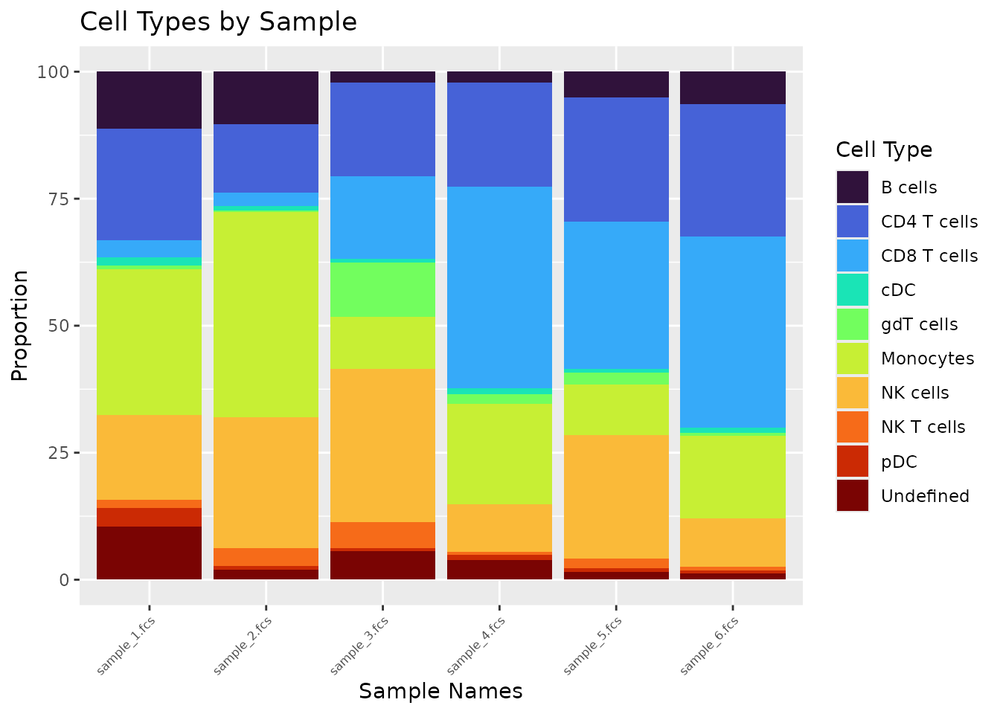

##### Differential Abundance

Once these matrices have been acquired, to perform differential
abundance analysis, the user only needs to pass them to
[`doDAAnalysis()`](https://00berst33.github.io/flowFun/reference/doDAAnalysis.md),
and specify a normalization method, if any. Results are returned as a
list, where each entry is a table corresponding to a comparison. The
tables are named after the comparison they correspond to, and contain
results of likelihood ratio tests performed by edgeR, with each test
being ranked by its adjusted p-value.

Results are also saved as a .csv file for each comparison in the
directory `Analysis Results/edgeR`. If running an edgeR analysis on
multiple objects, or running the script multiple times for any reason,
the user may wish to create sub-directories within
`Analysis Results/edgeR` to stay organized. To do this, simply set the
parameter to a preferred sub-directory name.

``` r

# Perform differential abundance analysis
da_results <- doDAAnalysis(design = design, 
                           counts = counts, 
                           contrasts = contrasts,
                           sample_df = sample_info, 
                           norm_method = "TMM")
```

The resulting individual tables may be accessed with either double
brackets `[[]]` or `$`, e.g. `da_results[[1]]` or
`da_results$MIBC_NAC__vs__MIBC_No.NAC`. In this example, two comparisons
were tested, so the resulting list contains two tables:

|             |   logFC    |  logCPM  |     LR     |  PValue   |    FDR    |
|:------------|:----------:|:--------:|:----------:|:---------:|:---------:|
| CD8 T cells | 3.6623055  | 17.89559 | 19.2176370 | 0.0000117 | 0.0001166 |
| gdT cells   | 2.2784561  | 14.61224 | 7.9828538  | 0.0047222 | 0.0236112 |
| B cells     | -1.4097480 | 15.95320 | 4.5262772  | 0.0333782 | 0.1112605 |
| pDC         | -1.1579266 | 13.57279 | 2.7638714  | 0.0964147 | 0.2183833 |
| Monocytes   | -1.0572831 | 17.74244 | 2.5658820  | 0.1091916 | 0.2183833 |
| Undefined   | -0.9770537 | 15.23179 | 2.1096918  | 0.1463688 | 0.2439480 |
| NK T cells  | -0.5652026 | 14.36619 | 0.6771558  | 0.4105679 | 0.5157025 |
| CD4 T cells | 0.5717352  | 17.72041 | 0.6714055  | 0.4125620 | 0.5157025 |
| NK cells    | -0.2700034 | 17.49211 | 0.1603990  | 0.6887894 | 0.7653216 |
| cDC         | -0.0706732 | 13.39673 | 0.0095477  | 0.9221609 | 0.9221609 |

Ctrl vs. MIBC {.table}

|             |   logFC    |  logCPM  |    LR     |  PValue   |    FDR    |
|:------------|:----------:|:--------:|:---------:|:---------:|:---------:|
| gdT cells   | -1.9300313 | 14.61224 | 5.4438493 | 0.0196373 | 0.1871219 |
| B cells     | 1.5868599  | 15.95320 | 3.7833727 | 0.0517642 | 0.1871219 |
| Undefined   | -1.5687720 | 15.23179 | 3.6480008 | 0.0561366 | 0.1871219 |
| NK T cells  | -0.7921997 | 14.36619 | 0.9512847 | 0.3293925 | 0.8234813 |
| CD4 T cells | 0.5053760  | 17.72041 | 0.4118722 | 0.5210208 | 0.9758713 |
| pDC         | -0.3963277 | 13.57279 | 0.2189696 | 0.6398261 | 0.9758713 |
| CD8 T cells | 0.2728881  | 17.89559 | 0.1206982 | 0.7282784 | 0.9758713 |
| Monocytes   | -0.0912682 | 17.74244 | 0.0134538 | 0.9076601 | 0.9758713 |
| cDC         | 0.0678355  | 13.39673 | 0.0065959 | 0.9352707 | 0.9758713 |
| NK cells    | -0.0237663 | 17.49211 | 0.0009148 | 0.9758713 | 0.9758713 |

NAC vs. No NAC {.table}

##### Differential Expression

To test for differential expression, the design and contrast matrices
must again be specified, in addition to the markers to be tested. Recall
that in most cases, these markers should not be the same as those used
for clustering.

Before testing, median fluorescent intensities (MFIs) must be found for
the markers of interest. If expression data is in a `data.table` format,
the function
[`getExprMatDE()`](https://00berst33.github.io/flowFun/reference/getExprMatDE.md)
may be used to do so. If using a `GatingSet` object, the function
[`gs_makeMFIMatrix()`](https://00berst33.github.io/flowFun/reference/gs_makeMFIMatrix.md)
should be used instead.

By default, the data is kept on the scale it was transformed to during
preprocessing. If the user prefers output to match the scale of the raw
data, inverse transformations should be applied before calculating any
aggregate statistics and/or performing tests.

``` r

# Define channels of interest
marker_cols <- c("FITC-A", "BV711-A")

# Perform differential expression analysis
de_res <- doDEAnalysis(fsom_dt, 
                       cols_to_test = marker_cols, 
                       design = design, 
                       contrasts = contrasts)

# View results
limma::topTable(de_res)
#>                       feature MIBC_No.NAC_OR_MIBC_NAC__vs__Ctrl_X
#> 10  NK T cells.TIM3 <BV711-A>                         -0.21732188
#> 17   gdT cells.PHA-L <FITC-A>                         -0.20426559
#> 9   NK T cells.PHA-L <FITC-A>                         -0.09168521
#> 4  CD4 T cells.TIM3 <BV711-A>                          0.10286847
#> 16         cDC.TIM3 <BV711-A>                         -0.24827906
#> 12    NK cells.TIM3 <BV711-A>                         -0.02201422
#> 20         pDC.TIM3 <BV711-A>                          0.01893114
#> 2      B cells.TIM3 <BV711-A>                          0.04169904
#> 15         cDC.PHA-L <FITC-A>                         -0.14705205
#> 11    NK cells.PHA-L <FITC-A>                         -0.11186719
#>    MIBC_NAC__vs__MIBC_No.NAC  AveExpr         F    P.Value adj.P.Val
#> 10                0.32466246 1.363133 4.5323285 0.02619657 0.5239314
#> 17               -0.28085816 2.532910 1.9951677 0.16617913 0.8426767
#> 9                -0.24852449 2.715640 1.2115466 0.32186197 0.8426767
#> 4                -0.02965683 1.055500 1.0567659 0.36904211 0.8426767
#> 16                0.05382806 1.852949 1.0391065 0.37489880 0.8426767
#> 12                0.23954436 1.668804 0.8527753 0.44344263 0.8426767
#> 20                0.38041863 1.905086 0.7483075 0.48792439 0.8426767
#> 2                 0.10172796 1.013840 0.7029336 0.50877799 0.8426767
#> 15               -0.03708100 2.762316 0.6766949 0.52128999 0.8426767
#> 11               -0.13311684 2.704831 0.6679475 0.52553722 0.8426767
```

Difference in marker expression between group may also be visualized
with the function
[`plotGroupMFIBars()`](https://00berst33.github.io/flowFun/reference/plotGroupMFIBars.md).
To use it, a matrix of MFIs for the marker of interest should be
generated; if data is a `FlowSOM` object or `data.table` do so with
[`getSampleMetaclusterMFIs()`](https://00berst33.github.io/flowFun/reference/getSampleMetaclusterMFIs.md),
if data is a `GatingSet` do so with `gs_getSampleMetaclusterMFIs()`.

Note that if input is a `GatingSet` with transformations attached, the
data may be back-transformed to the linear scale before the calculation
of MFIs or statistical tests.

``` r

# Get table with MFIs where rows are sample and columns are metaclusters
plot_mat <- getSampleMetaclusterMFIs(fsom_dt, "BV711-A", sample_info)

# Generate bar plot
plotGroupMFIBars(plot_mat, 
                 sample_df = sample_info, 
                 comparison = comparisons[[1]])
```

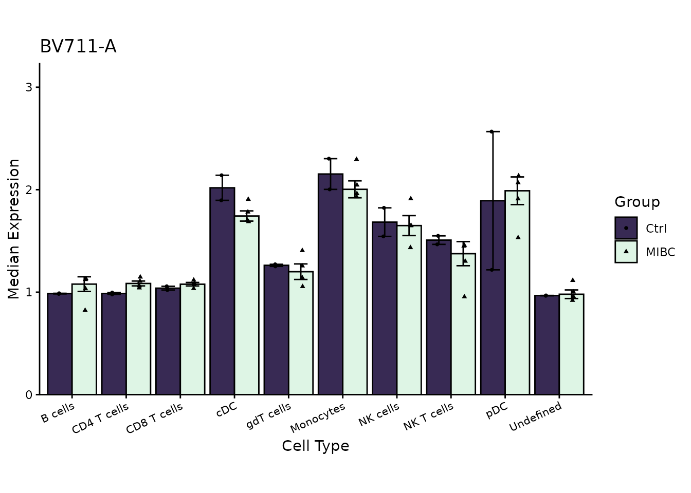

Finally, grouped dimension reduction plots may be generated, colored
either by density or marker expression, then compared against their
parent plot if one exists.

``` r

# Make new parent umap
umap <- plotUMAP(fsom_dt, num_cells = 7500, seed = 42)

# Color by density
plotGroupUMAPs(fsom_dt, sample_info, comparisons[[1]], umap = umap)

# May also color by marker expression
plotGroupUMAPs(fsom_dt, sample_info, comparisons[[1]], color_by = "BV711-A", umap = umap)
```

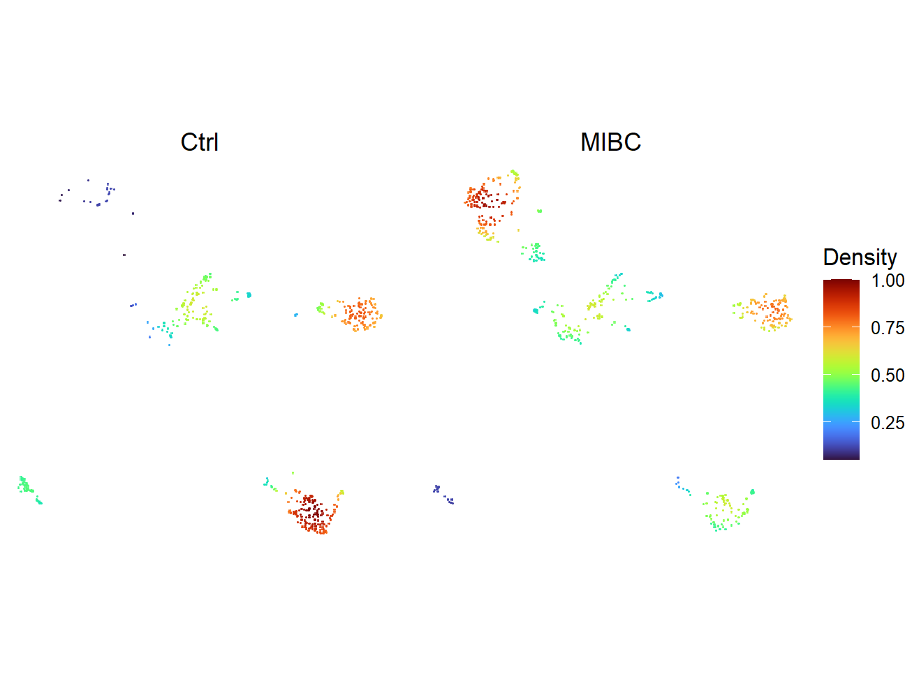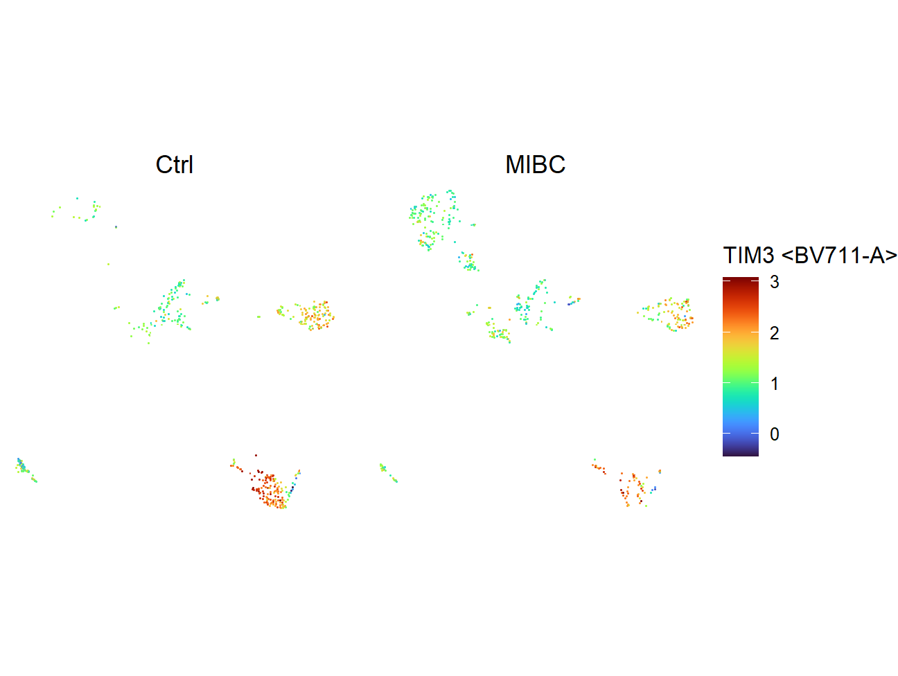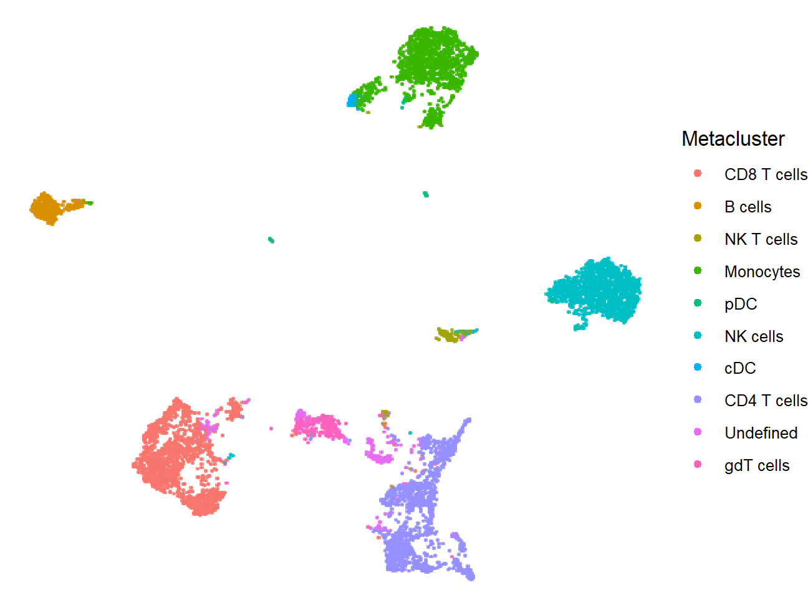
