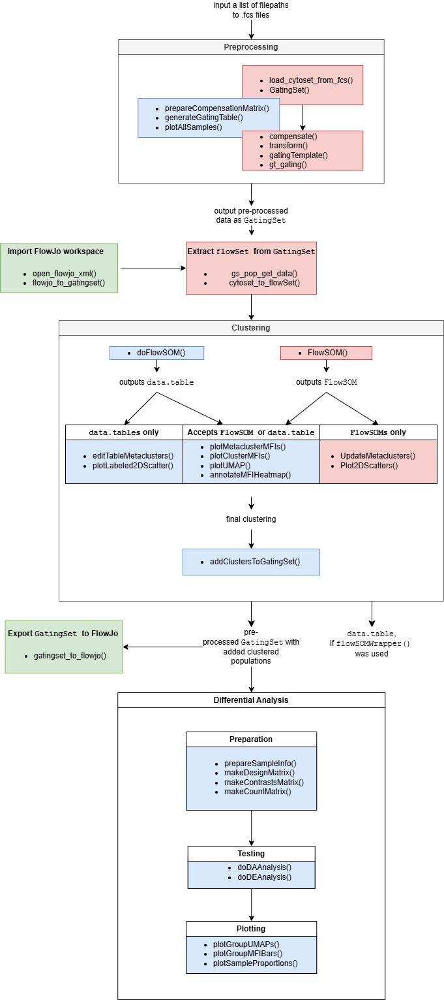

```{r setup, include = FALSE}
knitr::opts_chunk$set(
  eval = TRUE,
  collapse = TRUE,
  comment = "#>"
)

library(flowFun)
```

To improve the accessibility of the package, `flowFun` provides a number of template scripts for users to make getting started less daunting. When viewing the GitHub page, these may be found in the `\scripts` folder. Vignettes giving more detailed walkthroughs of a typical analysis may also be found by clicking the 'Articles' tab above. On this page, we will give a brief overview of the package, and recommend how users can best use its documentation to inform their analyses.

## Data types

There are four data types crucial to this pipeline that users should familiarize themselves with. The following table summarizes them:

:::{.border style="padding: 10px; border: 1px solid #dee2e6 !important;"}
```{r data-types, echo=FALSE}
df <- data.frame(Data.Type = c("flowFrame", "flowSet", "GatingHierarchy", "GatingSet"),
                 Description = c("A class belonging to the flowCore package. It stores the data contained in a single FCS file, including annotations and raw measurement values.", 
                                 "A class belonging to the flowCore package. A list of named flowFrames.", 
                                 "A class belonging to the flowWorkspace package. Analogous to the flowFrame, with two key differences: it holds the corresponding gating scheme in addition to the raw data, and is more space efficient.", 
                                 "A class belonging to the flowWorkspace package. Analogous to the flowSet. Holds a set of GatingHierarchies."))

knitr::kable(df, 
             format = "html", 
             align = "l", 
             col.names = c("Data Type", "Description"))
```
:::

Essentially, a `flowFrame` is a representation of an FCS file in R, the same way a `data.frame` is a representation of a CSV file in R. A `GatingHierarchy` stores the same information as a `flowFrame`, plus the gating scheme for that sample. 

### About the GatingSet

For this pipeline, the most important of these data types is the `GatingSet`, which holds a set of `GatingHierarchies`. Users who have performed flow analysis in R before may already be familiar with the `flowSet`, which is quite similar. However, `GatingSets` are more advantageous for a few reasons. For one, as mentioned above, in addition to the raw data `GatingSets` can hold information about any gates applied during analysis. Instead of having multiple sets of FCS files corresponding to raw data, preprocessed data, various subsets, etc., this data structure conveniently keeps everything in one place.

Additionally, `GatingSets` are far more memory efficient than `flowSets`. Rather than always having the full dataset loaded in memory, a `GatingSet` contains only a pointer to the data, which is stored compactly in C data structure. This makes performing operations on large datasets faster. Users who want to learn more should see the `flowWorkspace` documentation, which contains multiple helpful vignettes giving a more detailed explanation of `GatingSets`.

## Overview

`flowFun` implements an end-to-end pipeline for cytometry analysis, including data import, pre-processing, cell type identification, differential analysis, data visualization, and data export. Notably, `flowFun` was designed to allow users to easily import and export data at any stage of the analysis. 

For example, if a user has a dataset which has already been pre-processed, they may import their data and skip to cell type identification. Similarly, they may use this pipeline only for pre-processing, then export the results to use in another program. This feature is advantageous for users who have access to and more familiarity with certain cytometry analysis software like FlowJo or Diva. More details will be given later.

### Workflow diagram

The diagram below summarizes the workflow of a typical analysis, and the functions relevant to each step. Blue boxes contain functions native to `flowFun`, and red boxes contain necessary functions native to other packages. Green boxes contain optional functions for importing or exporting data in-between steps.

```{r print-diagram, echo=FALSE, out.width='100%', fig.align='center'}

```

## Data import

### flowSets

The chunk below gives an example of how a set of FCS files can be read into R as a `flowSet`. A `flowSet` can be subset with double brackets `[[`, so `fs[[1]]` gives the first `flowFrame` in the set, `fs[[2]]` gives the second `flowFrame` in the set, etc. This is done below to print the first element of the `flowSet` we read in.

```{r flowsets-ex}
library(flowCore)

# Specify path to .fcs file
dir <- system.file("extdata", "samples", package = "flowFunData")

# Read in as flowSet
fs <- read.flowSet(path = dir, pattern = "\\.fcs", truncate_max_range = TRUE)

# Print summary of first flowFrame/sample
fs[[1]]
```

We see a summary of the first sample; its filename is "sample_1.fcs", it contains 5000 cells, and data for 35 parameters. To get a table of the actual expression data, we use the function `exprs()` from the `flowCore` package.

```{r flowframe-head}
# Get expression matrix for first sample
ff_expr <- exprs(fs[[1]])

# Print first 4 rows
ff_expr[1:4, ]
```

We can also view information about the experiment's panel using the functions `pData()` and `parameters()` together. The `name` column lists channels, and `desc` lists the associated marker, if any.

```{r flowframe-assay}
# View marker/channel pairs and value ranges
pData(parameters(fs[[1]]))
```

The function `colnames()` may also be used to quickly view the channel names of a `flowSet`.

```{r flowset-cols}
# Get channel names
colnames(fs)
```

Finally, to view all filenames for the samples in a `flowSet`, use `sampleNames()`.

```{r flowset-names}
# Get sample names
sampleNames(fs)
```

### GatingSets

Interacting with a `GatingSet` is quite similar to the examples above. The `flowWorkspace` has a thorough vignette on this topic that may be brought up by typing `vignette(package = "flowWorkspace", "flowWorkspace-Introduction")` into the RStudio console, assuming the package has been installed and loaded. Here we will summarize the details essential to this pipeline, but if users feel in need of further clarification this vignette is highly recommended. 

#### Create from FCS files

There are multiple ways to create a `GatingSet`. The first is to generate one from a set of FCS files, like what was done for the `flowSet` above. The chunk below gives an example of how a set of FCS files may be read into a `GatingSet`.

```{r import-gatingset-from-fcs, message=FALSE}
library(flowWorkspace)

# Specify path to .fcs file
dir <- system.file("extdata", "samples", package = "flowFunData")

# Load cytoset from .fcs files
cs <- load_cytoset_from_fcs(path = dir, pattern = "\\.fcs", truncate_max_range = TRUE)

# Make GatingSet
gs <- GatingSet(cs)

# Print summary of first GatingHierachy in set
gs[[1]]
```

Instead of a call to `read.flowSet()`, we use `load_cytoset_from_fcs()`, then `GatingSet()`. Note that `gs[[1]]` prints different results than `fs[[1]]`; more on that later. 

#### Import from FlowJo workspace

With the help of the package `CytoML`, it is also possible to import a FlowJo workspace directly into R as a `GatingSet`. This package is not essential to `flowFun` and thus is not installed as a dependency. Users interested in this functionality must install it separately as follows:

```{r install-cytoml, eval=FALSE}
# Use devtools package to install from GitHub
library(devtools)
install_github("RGLab/openCyto")

# If this fails, try running:
BiocManager::install("openCyto") 
# then try again
```

The package's GitHub repository may also be viewed [here](https://github.com/RGLab/CytoML).

Once `CytoML` has been installed, importing a workspace is straightforward. Two things are required: a WSP file exported from FlowJo, and the filepath to the set of corresponding FCS files. The function `open_flowjo_xml()` opens the WSP file in R (despite the function name, it accepts a WSP file just fine), and `flowjo_to_gatingset()` generates the `GatingSet`.

```{r import-gatingset-from-flowjo, eval=FALSE}
library(CytoML)

# Get path to .wsp file
flowjo_file <- "path/to/flowjo.wsp"

# Import file
ws <- open_flowjo_xml(flowjo_file)

# Make GatingSet from FlowJo workspace
gs <- flowjo_to_gatingset(ws, path = "path/to/fcs_files")
```

#### Notes on importing GatingSets


