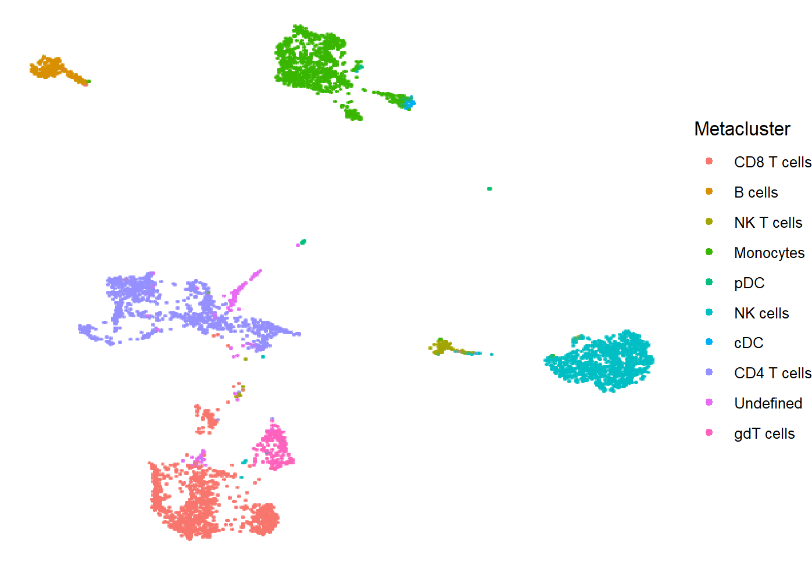

```{r setup, include=FALSE}
knitr::opts_chunk$set(echo = TRUE, message = FALSE, warning = FALSE, eval = FALSE)
library(flowFun)
library(flowFunData)
library(flowWorkspace)
library(ggplot2)
```

```{r requirements, echo=FALSE}
if (!require(flowFunData)) {
  stop("Cannot build the vignettes without 'flowFunData'")
}
```

## Setup

In this script, we're assuming that we already have a finalized clustering of our cell population, so only analysis after this step will be shown. Specifically, comparative analysis and visualizing results.

Below we read in our clustered data, define the comparisons between groups we would like to test, and supply a .csv file to tell the script more about each file.

It's important to make sure that the `comparisons` parameter is defined properly. Try `?prepareSampleInfo()` and read the examples of how to define it if you are unsure.

```{r setup-obj, eval=TRUE}
# Specify path to file with clustered data
data_file <- system.file("extdata", , package = "flowFunData")
dat <- read.csv(data_file)

# Make a nested list defining any comparisons you wish to make. See the examples
# in documentation for prepareSampleInfo() for a detailed explanation.
comparisons = list(
  ctrl_vs_mibc = list(disease = list("MIBC", "Ctrl")),
  nac_vs_no_nac = list(disease = "MIBC", NAC = list("NAC", "No.NAC"))
)

# Get path to file with sample information; must have a column for filenames
info_file <- system.file("extdata", "sample_info.csv", package = "flowFunData")

# Read in this file and prepare it for the pipeline
sample_info <- prepareSampleInfo(info_file,
                                 name_col = "sample.name",
                                 filename_col = "filename",
                                 comparisons = comparisons)

# Print the first few entries of `sample_info` to see what the .csv file should 
# look like
head(sample_info)
```

Note the added `group` column; this will be used later. 


## Plotting UMAPs

Here we show how to use the functions for plotting UMAPs in `flowFun`. It is only necessary to specify your data object. However, it is highly recommended that at the very least, a seed is specified, so that your results are replicable. By default, 5000 cells are used for plotting.

```{r default-umap, eval=FALSE, include=TRUE}
# Color single default UMAP by metacluster
plotUMAP(fsom_dt, seed = 42)
```

```{r print-first-umap, echo=FALSE, out.width='80%', fig.align='center'}

```

We may also manually specify the number of cells that should be used, the order the legend elements should appear in, and the colors to use for each metacluster. Note that while color codes are manually chosen here, it can also be convenient to use packages designed for this purpose, like `viridis` or `RColorBrewer.` 

A much larger number of cells is used for plotting here, because we will next be splitting the plot by group and recoloring.

```{r umaps, eval=FALSE, include=TRUE}
# Define colors to use
colors <- c("#F032E6", "#E6194B", "#FFE119", "#F58231", "#3CB44B", 
            "#BCF60C", "#4363D8", "#000075", "#911EB4", "#E6BEFF")
            # "#46F0F0",  "#008080", "#E6BEFF", "#FF4500", "#800000", "#0000FF"

# Define order labels should appear in the legend
labels <- c("CD8 T cells", "CD4 T cells", "B cells", "NK cells", "NK T cells", 
            "Monocytes", "gdT cells", "cDC", "pDC", "Undefined")

# Plot a UMAP according to custom choices
umap_full <- plotUMAP(fsom_dt, num_cells = 10000, labels = labels, colors = colors, seed = 42)
umap_full
```

```{r print-second-umap, echo=FALSE, out.width='80%', fig.align='center'}
knitr::include_graphics("images/visualization_vignette/big_umap.png")
```

To create UMAPs for the purpose of comparing groups, you may use a previously created aggregate UMAP, like the one above, by specifying the parameter `umap`. If you do not do this, a new UMAP will be generated. 

`num_cells` specifies the number of cells to include in the plot for each group. Note that, if you are generating the figure using a previous UMAP, this parameter is bounded by the number of cells for that group that already exist in that UMAP. If `num_cells` cannot be reached, the function instead sets it to the cell count from the least abundant group, and states the actual number of cells that were used for plotting. 

```{r group-umaps, eval=TRUE, message=TRUE}
# Color UMAPs by density for Ctrl vs. MIBC, using above plot
plotGroupUMAPs(fsom_dt, 
               sample_info, 
               comparisons[[1]], 
               umap = umap_full,
               num_cells = 5000)

# Color UMAPS by PHA-L expression, MIBC NAC vs. MIBC No.NAC
plotGroupUMAPs(fsom_dt, 
               sample_info, 
               comparisons[[2]], 
               umap = umap_full,
               color_by = "FITC-A",
               num_cells = 5000)
```

## Bar plots

In this section we demonstrate how to create bar plots for MFIs or counts by group. For most cases, all that's needed is a call to the function `plotGroupMFIBars()`. It should be noted that if your data was transformed during pre-processing, you will likely want to back-transform it to a linear scale before plotting so that the results are easier to interpret. 


When plotting MFIs, it is helpful to plot on a linear scale, so that the plots are easier to interpret. Our data in this example is on the log-icle scale, so we must perform the inverse of this transformation. This is easiest when working with a `GatingSet`, which stores cell data and any related transformations in one object. 


```{r bar-plots}
# MIBC vs. Ctrl, CD8 T cells
plotGroupMFIBars(fsom_dt, 
                 sample_info, 
                 col = ,
                 comparison = comparisons[[2]], 
                 populations = )

# NAC vs. No NAC
plotGroupMFIBars(fsom_dt, 
                 sample_info, 
                 col = ,
                 comparison = comparisons[[4]], 
                 populations = c("CD8 T cells", "CD4 T cells")) # specifying `populations` 
                                                                # as a list of strings is OK too

# NAC vs. No NAC, CD4 T cells
plotGroupMFIBars(fsom_dt, 
                 sample_info, 
                 col = ,
                 comparison = comparisons[[4]], 
                 populations = seq(1, 5))

# NAC vs. No NAC, CD4 T cells
# Scaled due to negative values
plotGroupMFIBars(il10r_mfis+100, 
                 sample_info, 
                 comparison = comparisons[[4]], 
                 meta_to_plot = seq(1,5), 
                 upper_lim = 360) # change the limit on the y-axis
```


This may be done by applying the `transformTable()` function to the FlowSOM object's data matrix, where the parameter `transformation` is set to the `transformList` that was originally applied to your data (in this case, this is the object contained in `logicle_transformation.rds`), `transform_type` is a string specifying what kind of transformation was applied, and `find_inverse` is `TRUE`. If your data was preprocessed via `flowFun` functions, it is only necessary to specify your data table and `find_inverse`. Regardless, it is a good idea to keep track of any transformations applied to your data, for the sake of reproducibility.

```{r create-tables}
# Read in transformation object
transform_list <- readRDS("logicle_transformation.rds")

# Transform data back to linear scale
fsom_temp <- fsom
fsom_temp$data <- transformTable(fsom_temp$data, transform_list, transform_type = "logicle",
                                 find_inverse = TRUE)
```

The next step to allow plotting of MFIs is creating an appropriate table. The plotting function `plotGroupMFIBars()`, for any single channel of interest, takes in a table where rows are files, columns are metaclusters, and values are the median fluorescence intensity for said channel in the current file/metacluster pair. These tables may be created with the function `getSampleMetaclusterMFIs()`, but any similarly structured table generated through other means can be used. The code below creates two of these tables, and prints part of the first, to demonstrate what an appropriate table looks like.

```{r mfi-tables}
# Make a table where rows are samples/files, and columns are metaclusters.
pha_mfis <- getSampleMetaclusterMFIs(fsom_temp, `FITC-A`, sample_info)
head(pha_mfis)

# Try another table, with a different marker.
il10r_mfis <- getSampleMetaclusterMFIs(fsom_temp, `BV421-A`, sample_info)
```

Finally, the code below uses the objects created above to create bar plots. Note that the parameter `comparison` is what dictates the groups plotted. Specifying it is straightforward, as any groups to be tested for differences should have been listed in one of the very first objects defined in this file, `comparisons`. For the sake of convenience, we'll show this object again here: 

```{r comparisons, eval=FALSE}
comparisons = list(
  male_vs_female = list(Sex = list("male", "female")),
  male_vs_female_mibc = list(Disease = "MIBC", Sex = list("male", "female")),
  ctrl_vs_mibc = list(Disease = list("MIBC", "Ctrl")),
  nac_vs_no_nac = list(Disease = "MIBC", NAC = list("NAC", "No.NAC"))
)
```

To choose the groups we'd like to plot, it's easiest to select the comparison we're interested in from this list of lists as `comparisons[[i]]`, as seen below. `meta_to_plot` selects the columns from `pha_mfis` (in other words, the metaclusters) to include in the plot.

```{r bar-plots}
# Male MIBC vs. Female MIBC, CD8 T cells
plotGroupMFIBars(pha_mfis, sample_info, 
                 comparison = comparisons[[2]], 
                 meta_to_plot = seq(8, 12))

# NAC vs. No NAC, CD8 T cells
plotGroupMFIBars(pha_mfis, sample_info, 
                 comparison = comparisons[[4]], 
                 meta_to_plot = c("CD8 T cell other", "CD8 Tcm", "CD8 Tem", # specifying `meta_to_plot` as a list of strings
                                  "CD8 Temra", "CD8 Tscm"))                 # is OK too

# NAC vs. No NAC, CD4 T cells
plotGroupMFIBars(pha_mfis, sample_info, 
                 comparison = comparisons[[4]], 
                 meta_to_plot = seq(1, 5))

# NAC vs. No NAC, CD4 T cells
# Scaled due to negative values
plotGroupMFIBars(il10r_mfis+100, sample_info, 
                 comparison = comparisons[[4]], 
                 meta_to_plot = seq(1,5), 
                 upper_lim = 360) # change the limit on the y-axis
```

### Plot customization

Below are some examples regarding customization of this plot.

If you are only interested in changing axes and title names, add the `labs()` function from `ggplot2`.

```{r custom1} 
plotGroupMFIBars(pha_mfis, sample_info, 
                 comparison = comparisons[[4]], 
                 meta_to_plot = seq(1, 5)) +
  labs(title = "PHA-L MFIs vs. CD4 T cell type", 
       x = "Metacluster",
       y = "PHA-L MFI")
```

To customize the colors, point shapes, and legend, use `scale_fill_manual()` and `scale_shape_manual()`.

```{r custom2}
plotGroupMFIBars(pha_mfis, sample_info, 
                 comparison = comparisons[[4]], 
                 meta_to_plot = seq(1, 5)) + 
  scale_fill_manual(name = "NAC Group",                                # renames legend title for group bars,
                    labels = c("MIBC NAC", "MIBC No NAC"),             # picks new names for legend items
                    values = c("dodgerblue4", "firebrick4")) +         # picks new colors for bars
  scale_shape_manual(name = "NAC Group",                               
                     labels = c("MIBC NAC", "MIBC No NAC"),            
                     values = c("circle", "triangle"))                 # picks new shapes for data points
```

If you only wish to change colors, just specifying `values` is enough.

```{r custom3}
plotGroupMFIBars(pha_mfis, sample_info, 
                 comparison = comparisons[[4]], 
                 meta_to_plot = seq(1, 5)) + 
  scale_fill_manual(values = c("dodgerblue4", "firebrick4")) 
```

Note that giving different parameters to the `name` and/or `labels` parameters results in two legends.

```{r custom4}
plotGroupMFIBars(pha_mfis, sample_info, 
                 comparison = comparisons[[4]], 
                 meta_to_plot = seq(1, 5)) + 
  scale_fill_manual(name = "NAC Group",                             
                    labels = c("MIBC NAC", "MIBC No NAC"),           
                    values = c("dodgerblue4", "firebrick4")) +         
  scale_shape_manual(name = "Groups",                               
                     labels = c("MIBC NAC", "MIBC No NAC"),            
                     values = c("circle", "triangle"))  
```
