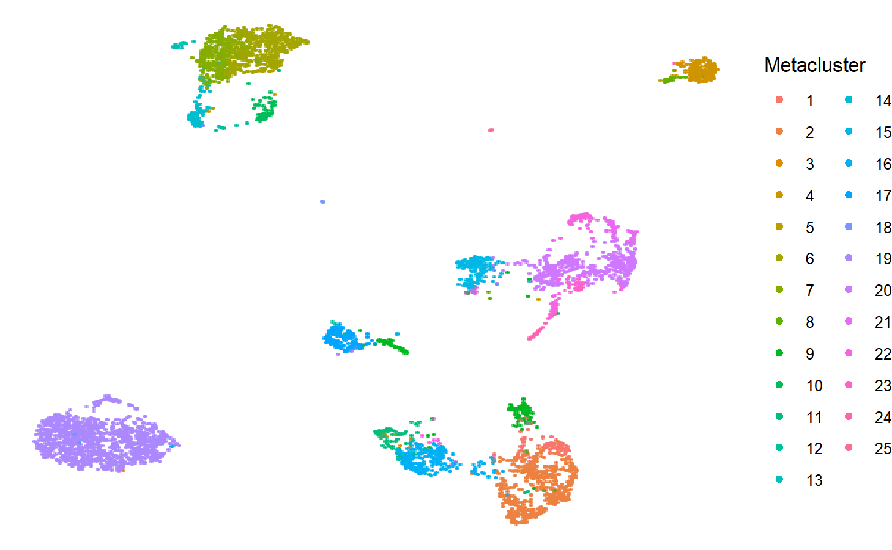
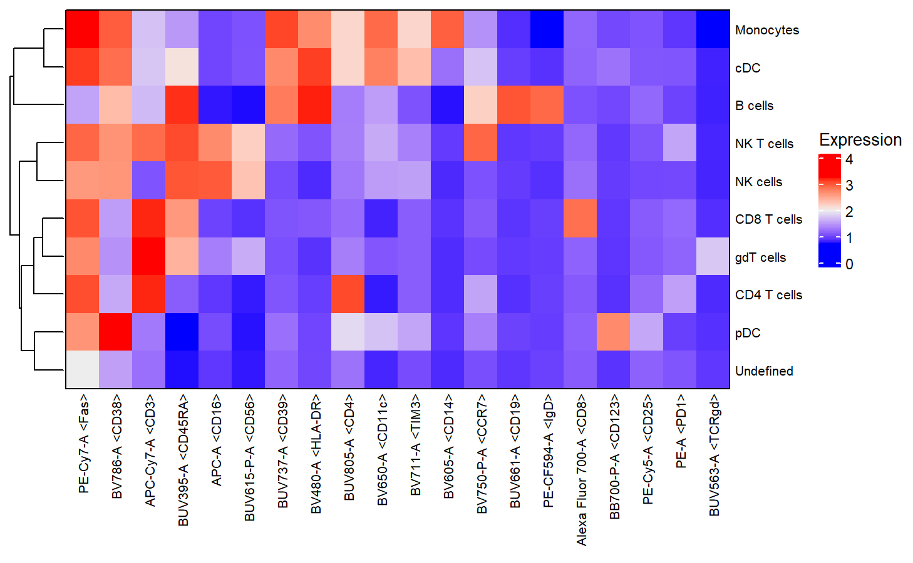
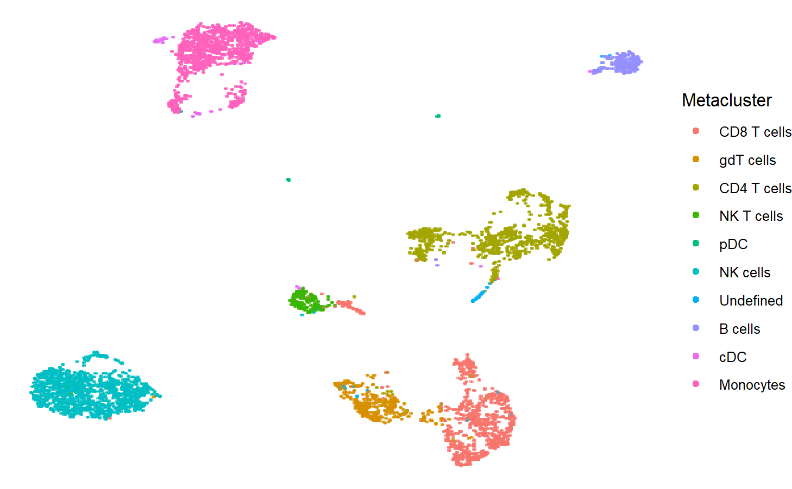
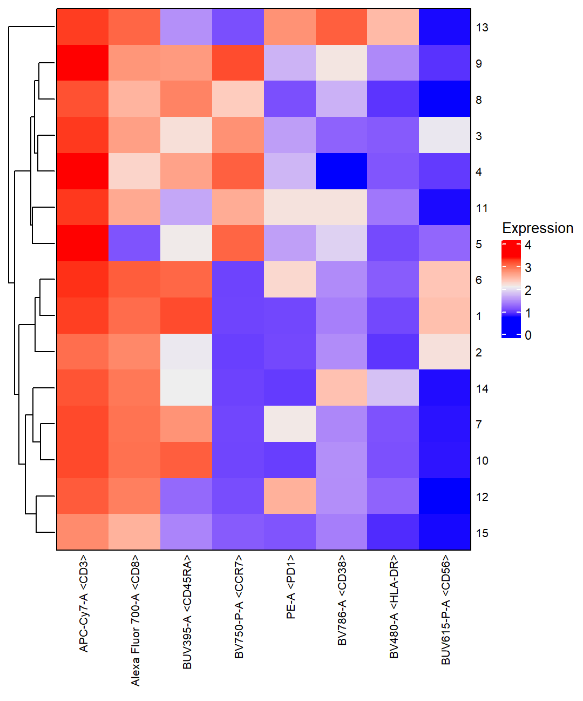
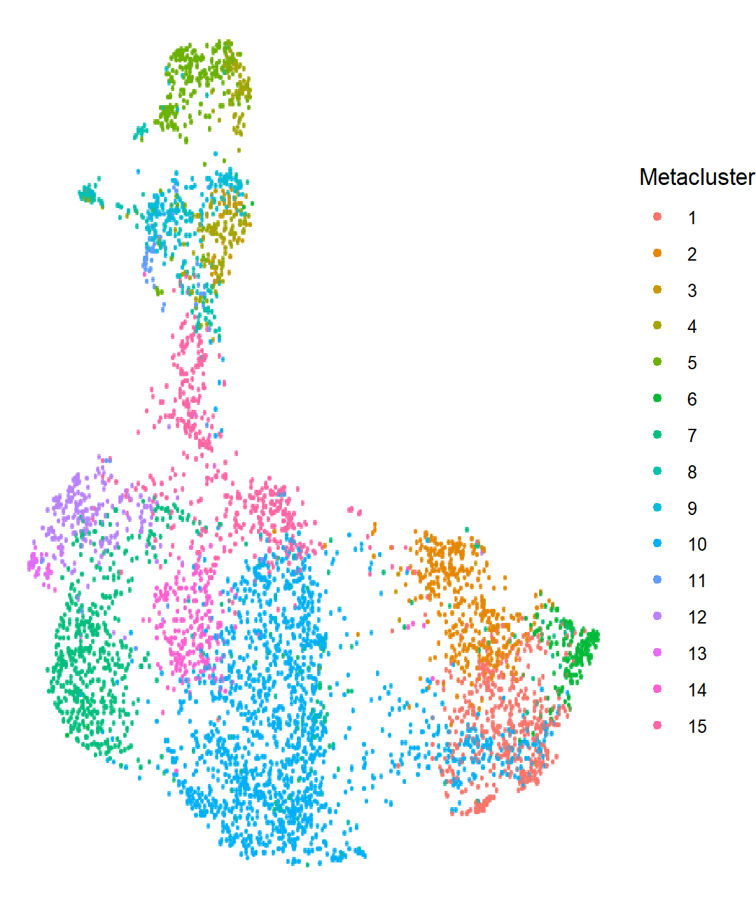

```{r setup, include = FALSE}
knitr::opts_chunk$set(
  warning = FALSE,
  message = FALSE,
  collapse = TRUE,
  comment = "#>"
)
```


```{r requirements, echo=FALSE}
if (!require(flowFunData)) {
  stop("Cannot build the vignettes without 'flowFunData'")
}
if (!require(openCyto)) {
  stop("Cannot build the vignettes without 'openCyto'")
}
```

# Installation

Data used for this vignette is kept in a separate R package, `flowFunData`. To install
`flowFun` with built vignettes, users should run the following code. 

```{r, eval=FALSE}
install.packages("devtools")

# Install with vignettes
#   The package 'flowFunData' must first be installed
devtools::install_github("00berst33/flowFunData")
#   Then install flowFun
devtools::install_github("00berst33/flowFun", dependencies = TRUE, build_vignettes = TRUE)
```

Otherwise, to get started with the package more swiftly, the user may install `flowFun`
without its vignettes. 

```{r, eval=FALSE}
install.packages("devtools")

# Install without vignettes
#   No installation of 'flowFunData', set argument `build_vignettes` to FALSE
devtools::install_github("00berst33/flowFun", dependencies = TRUE, build_vignettes = FALSE)
```

# Data Import

Blob Cytometry data often contains millions of cells, so to facilitate fast and efficient manipulation of these large datasets, this package implements data structures from the `flowWorkspace` package; particularly the `cytoframe`, `cytoset`, `GatingHierarchy`, and `GatingSet`. 

The `cytoframe` and `cytoset` are analogous to the more well known `flowSet` and `flowFrame` structures, but instead of storing data in memory they store only a pointer to the underlying data (i.e. they are reference classes). The size of this pointer is negligible compared to the size of cytometry datasets, making operations with `cytosets` and `cytoframes` far more memory efficient. 

The `GatingHierarchy` and `GatingSet` build upon the `cytoset` and `cytoframe`. They store not just the single cell data, but also samples, groups, transformations, compensation matrices, and gates, conveniently all in one object. Other advantages are that they facilitate automatic gating in R, and the importing of workspaces from external software like FlowJo and Cytobank. These capabilities will be discussed further below.

Understanding these data structures in detail is not absolutely required to use this pipeline, but for those that would like to learn more, see the relevant documentation in `flowWorkspace`. An introductory vignette explaining the basics of these objects may be brought up in RStudio by entering `vignette(package="flowWorkspace", "flowWorkspace-Introduction")` into the console. 

Below, we demonstrate how data may be imported into R from two possible sources: a set of FCS files, or a FlowJo/Diva/Cytobank workspace. 

### Reading in FCS files

Most often, a user has a directory or set of directories containing FCS files that they would like to import into R. The chunk below demonstrates how to prepare a set of FCS files as a `GatingSet`. 

```{r load-data-flowworkspace}
library(flowWorkspace)
library(flowFun)
library(tidytable)

# Specify path to .fcs file
dir <- system.file("extdata", "samples", package = "flowFunData")

# Load cytoset from .fcs files
cs <- flowWorkspace::load_cytoset_from_fcs(path=dir, pattern=".fcs")

# Make GatingSet
gs <- flowWorkspace::GatingSet(cs)
```

First the user specifies the name of the folder containing their FCS files, which are then loaded into a `cytoset` with the function `load_cytoset_from_fcs()`. This `cytoset` is then used to construct a corresponding `GatingSet`; note that both objects point to the same underlying data. 

Due to its nature as a reference class, working with data in a `GatingSet` requires slightly more consideration. The fact that the objects `gs` and `cs` point to the same underlying data means that any changes made to one will also be applied to the other. This concept applies to any copy or subset of them. 

To demonstrate this, we first examine the channel names of the samples in `cs`.

```{r reference-class-initial}
# Get cytoset channel names
colnames(cs)
```

Next we change the first channel name and observe what happens to the column names of `gs`.

```{r reference-class-after}
# Change name of first channel in cytoset
colnames(cs)[1] <- "EDIT"

# Print resulting GatingSet column names
colnames(gs)
```

We see that despite never directly writing code to change the channel names in `gs`, the channel name `"FSC-A"` has also been changed to `"EDIT"`. 

Without being aware of this property of reference classes, a user could unknowingly make edits to their underlying data while performing analysis. However, this error is easily avoided by making a "deep copy" with the function `gs_clone()`. The resulting `GatingSet` is identical to the one it was made from, other than the critical difference that it does not point to the same underlying data. Edits may be made to the clone freely, without the potential of unintentionally overwriting original data or unsaved changes.

Users should make a clone of their `GatingSet` as below before proceeding with analysis.

```{r undo-rename, include=FALSE}
colnames(cs)[1] <- "FSC-A"
```

```{r gatingset-copy}
# Clone GatingSet
gs1 <- flowWorkspace::gs_clone(gs)
```


```{r add-metadata, eval=FALSE, include=FALSE}
# Get data.frame with sample info
file <- system.file("extdata", "sample_info.csv", package = "flowFunData")
samples_df <- read.csv(file)


# pick columns to keep 


# Add metadata to GatingSet
pd <- flowWorkspace::pData(gs1)
flowWorkspace::pData(gs1) <- cbind(pd, samples_df)

# look at phenoData for cytoset

# Check for and remove duplicate columns
gs1_pd <- flowWorkspace::pData(gs1)
dupes <- t(gs1_pd) %>% 
  duplicated()
dupes <- dupes[dupes == TRUE] %>%
  names()

gs1_pd <- gs1_pd %>%
  dplyr::select(!names)
```

```{r print-table, fig.align='center', echo=FALSE, include=FALSE, eval=FALSE} 
table$.id <- basename(table$.id)

table %>% 
  tidytable::select(tidytable::all_of(1:10)) %>%
  tidytable::slice_head(5) %>%
  data.frame() %>%
  knitr::kable(
    format = "html",
    align = "c",
    linesep = "",
    )
```


### Reading in FlowJo workspace

Users with data in FlowJo, Diva, or Cytobank may have interest in the R package `CytoML`. Workspaces from these softwares may be imported into R as a `GatingSet`, with transformations, compensations, and gating schemes preserved. This gives users who may prefer to perform preprocessing steps in one of these programs the ability to easily move between R and their program of choice.

The code below demonstrates how a user may import a workspace from FlowJo as a GatingSet. All that is required is the path to an XML file.

```{r external-workspace, eval=FALSE}
# Open FlowJo workspace in R from .xml file
flowjo_file <- "path/to/flowjo.xml"
ws <- CytoML::open_flowjo_xml(file)

# Make GatingSet from FlowJo workspace
gs <- CytoML::flowjo_to_gatingset(ws,
                                  path = "path/to/fcs_files")
```

A `GatingSet` may also be exported as a workspace with the use of Docker; interested users should see the GitHub repository for `CytoML`.

# Preprocessing

Once setup files have been cleaned and a compensation matrix has been generated, the next step is to preprocess the raw data. In order, the steps this pipeline implements are as follows:

1. Removing margin events (i.e. values that fall outside the range the cytometer should be able to pick up).
2. Removing doublets.
3. Removing debris.
4. Compensating the data.
5. Transforming the data.
6. Removing dead cells.
      
Each these steps, other than acquiring a compensation matrix, may be left entirely automated if desired. However, oftentimes parameter tuning is necessary for optimal results. Furthermore, some samples' data may be distributed in a way that is markedly different from the average, making automated gating ineffective. For this reason the user also has the option of manually drawing gates, by either simply using the same one for each sample, or retroactively selecting samples which the automated gating performed poorly for and re-drawing gates as necessary. Although it is implemented, it is recommended to avoid manual gating where possible. Doing so improves the objectivity and reproducibility of the analysis.

This pipeline primarily uses the package `openCyto` to implement preprocessing. This package can create an automated gating pipeline using a `gatingTemplate`, which is specified by a user-created spread sheet with 10 columns: `alias`, `pop`, `parent`, `dims`, `gating_method`, `gating_args`, `collapseDataForGating`, `groupBy`, `preprocessing_method`, and `preprocessing_args`. To see the details on how the values for these columns should be entered, see the `openCytoVignette` in the `openCyto` package. `flowFun` contains a default `gatingTemplate` that will draw the basic gates, so most users only need to understand how to appropriately edit this file, and not concern themselves with making one from scratch.

However, the user will have to supply a compensation matrix and choose whatever transformation they would like to apply. Additionally, if your panel includes a viability stain, it is necessary to specify the corresponding channel, so that dead cells may be gated out accurately.

The code below reads in the default CSV file and prints its contents, then creates a corresponding `gatingTemplate`.

```{r gating-template}
library(openCyto)

# Specify L/D stain
ld_stain <- "BUV496-A"

# Gating template
# Try editing the data.table yourself if you would like to add more gates.
# For explanations on how to do this, try running each command in the R console:
#   `vignette(package="openCyto", "openCytoVignette")`
#   `vignette(package="openCyto", "HowToAutoGating")`
# They each will take you to page that shows you how this file should look, and
# what it can be used for.

num_samples <- length(gs1)
ld_stain <- "BUV496-A"

gt_table <- data.table(alias = c("nonMargins", "nonDebris", "singlets", "live"),
                       pop = c("+", "+", "+", "-"),
                       parent = c("root", "nonMargins", "nonDebris", "singlets"),
                       dims = c("FSC-A,SSC-A", "FSC-A", "FSC-A,FSC-H", ld_stain),
                       gating_method = c("boundary", "gate_mindensity", "singletGate", "gate_mindensity"),
                       gating_args = c("min=c(0,0),max=c(262143,262143)", "gate_range=c(15000,80000)", NA, "gate_range=c(1,2)"),
                       collapseDataForGating = c(TRUE, TRUE, TRUE, TRUE),
                       groupBy = rep(num_samples, 4),
                       preprocessing_method = c(NA, NA, NA, NA),
                       preprocessing_args = c(NA, NA, NA, NA))
gt <- openCyto::gatingTemplate(gt_table)

# Visualize gating template
plot(gt)
gt_table
```

The first notable item in this file that a user may want to edit is `groupBy`; to apply the same gate to all samples, this value should be equivalent to the number of samples in your experiment. In this example, we have 6 samples. 

It may also be helpful to edit `gating_args`. Again, more details can be found in the `openCyto` vignettes, but it is most relevant to know that the parameter `gate_range` restricts the range of the automated gate being applied at that step. So, for row 2, whose alias is `nonDebris` (i.e. where a gate will be constructed around non-debris events), we have `gate_range=c(15000,80000)`, therefore the gate cannot be placed outside of that range for FSC-A.

Also, if the user does not have a live/dead stain, the fourth row with alias `live` should be removed.

Below, the compensation matrix is read in, the transformation applied, and the automated gating applied and visualized.

```{r preprocessing, fig.height=5, fig.width=7}
detach("package:tidytable", unload = TRUE)
library(ggcyto)

# Compensation matrix csv
comp_mat <- system.file("extdata", "compensation_matrix.csv", package = "flowFunData")
comp_mat <- read.csv(comp_mat, check.names = FALSE)

# !!! func to edit colnames automatically

# Compensate
# !!! Note: The column names of your compensation matrix must match those
#     found in your GatingSet.
#   Check that that is the case here:
colnames(comp_mat)
colnames(gs1)

compensate(gs1, comp_mat)


# Transform
trans <- flowCore::estimateLogicle(gs1[[1]], channels = colnames(comp_mat))
flowCore::transform(gs1, trans)


# Apply gating scheme
gt_gating(gt, gs1)

library(tidytable)


## Check one gate for each sample
# nonDebris gate
plotAllSamples(gs1, "FSC-A", "SSC-A", "nonMargins", "nonDebris")

# singlets gate
plotAllSamples(gs1, "FSC-A", "FSC-H", "nonDebris", "singlets")

# live cell gate
plotAllSamples(gs1, !!enquo(ld_stain), "FSC-A", "singlets", "live")
```

Here we see that the gates for dead cells and doublets are a bit loose for this sample. As an easy fix, we may adjust and draw a simple manual gate. This can be done by calling the function `editGateManual()`, which brings up an R Shiny window where the user may draw a new boundary, rectangle, ellipsoid, or polygon gate on the sample of interest. The data in the underlying `GatingSet` is edited accordingly. 

```{r manual-fix, fig.height=5, fig.width=7, fig.align='default', message=FALSE, eval=FALSE} 
##### Redraw gates manually, if desired
### Edit gate for one sample:
# Check gate before:
autoplot(gs1[[4]])

# Redraw gate
editGateManual(gs1,
               node = "nonDebris",
               dims = c("FSC-A", "SSC-A"),
               sample_ids = 4)

# Check gate after:
autoplot(gs1[[4]])

### Edit a gate for a subset of samples:
# Redraw gate
editGateManual(gs1,
               node = "singlets",
               # dims = c("FSC-A", "FSC-H"), # if `dims` isn't specified, the dimensions used in original gate are used
               ref_sample = 1,
               sample_ids = 1:3) # sample_ids may also be a vector of sample indices/names to apply the new gate to

# Plot singlets gate after:
plotAllSamples(gs1, "FSC-A", "FSC-H", "nonDebris", "singlets")

# May also plot a subset of the GatingSet, for example:
plotAllSamples(gs1[1:3], "FSC-A", "FSC-H", "nonDebris", "singlets")

### Edit a gate for all samples:
editGateManual(gs1,
               node = "live",
               dims = c("BUV496-A", "FSC-A"),
               ref_sample = 3) # sample to draw gate on; applied to all other samples when no `sample_ids` given

# Plot live cell gate after:
plotAllSamples(gs1, !!enquo(ld_stain), "FSC-A", "singlets", "live")

```

Once preprocessing results appear satisfactory, the user can either export results to FlowJo using the `CytoML` package (note: this requires Docker to be installed) or continue with this pipeline to cluster data.

It is recommended that the user saves their `GatingSet` before continuing. Recall that the earlier preprocessing steps were performed on a deep copy of the data to make edits more easily reversible, and avoid accidentally changing the underlying data. At this point the preprocessing steps are final, and so they should be saved so that progress is not lost. To save a `GatingSet`, create a new folder in an appropriate directory, then call `flowWorkspace::save_gs()`. Note that more than one `GatingSet` may not be saved to the same directory.

```{r save-gs, eval=FALSE}
# Specify name of directory to save to
path <- file.path(getwd(), "gating_set")

# Make directory if it doesn't exist
dir.create(path)

# Save GatingSet
flowWorkspace::save_gs(gs1, path = path) # Set `path` to the name of your chosen directory
```

After saving the user may safely close their R session and return later, if desired. To load a previously saved `GatingSet`, use `flowWorkspace::load_gs()`. The only input necessary is the name of the folder the `GatingSet` was saved to. 

```{r load-gs, eval=FALSE}
# Load saved GatingSet
flowWorkspace::load_gs(path)
```

# Clustering

This package is compatible with various clustering algorithms, but was designed specifically with FlowSOM in mind due to its fast runtime and tools for data visualization. Therefore, much focus will be given to FlowSOM in the following section.

The strategy for identifying cell type populations outlined by this workflow is not entirely automated, and instead uses a human-in-the-loop approach. Such an approach aims to reduce the burden of analyzing such a large volume of data, while still incorporating expert knowledge to ensure that results are biologically meaningful. To accomplish this, the data is initially overclustered. The expert then examines the result of the clustering through various relevant plots, taking into account not only marker expression but also cluster sizes and mathematical distance, and uses their best judgement to merge clusters until an appropriate final clustering has been reached and labelled. 

It is also necessary for the user to specify which markers are to be used for clustering. There are a few considerations to account for when selecting these, the most important being that it is highly recommended that any markers the user intends to test for differential expression are NOT used for clustering. There is a number of reasons for this, but in short, it generally makes little sense to test for differential expression of a marker in a cluster when the cluster is defined by high or low expression of said marker (i.e. testing for differential expression of CD8 in CD8 T cells). Furthermore, parameters like side and forward scatter should not be included, and if a viability stain was used, it should also be excluded.

Below, the preprocessed data from earlier is clustered using the FlowSOM algorithm via the function `flowSOMWrapper()`. This outputs the same table that is given to it, but with the columns `Metacluster` and `Cluster` joined to the right, giving the results of the clustering. Specifying a seed is optional, but strongly recommended for the sake of reproducibility.

``` {r flowsom-clustering}
library(tidytable)

# Read in table
prepr_table <- system.file("extdata", "prep_table.rds", package = "flowFunData")
prepr_table <- readRDS(prepr_table)

# Define markers/columns to use for clustering
cols_to_cluster <- c(12, 14:16, 18, 20:25, 27:34, 36)

# Perform clustering
fsom_dt <- flowSOMWrapper(prepr_table,
                          cols_to_cluster = cols_to_cluster,
                          num_clus = 25,
                          xdim = 12,
                          ydim = 12,
                          seed = 42)

```

```{r alternate-clustering, eval=FALSE, include=FALSE}
prepr_df <- prepr_table %>%
  as.data.frame()
col_names <- colnames(prepr_df)[cols_to_cluster]

fmeans <- flowMeans(prepr_df, 
                    varNames = col_names, 
                    MaxN = 20, 
                    Standardize = FALSE, 
                    addNoise = FALSE)
meta_vector <- fmeans@Label
# PhenoGraph, from cytofkit?

```

```{r print-fsom-table, echo=FALSE} 
fsom_dt %>% 
  tidytable::select(tidytable::all_of(c("cell_id", "Metacluster", "Cluster"))) %>%
  tidytable::slice_head(5) %>%
  data.frame() %>%
  knitr::kable(
    format = "html",
    align = "c",
    linesep = "",
    )
```

A number of different plots may be generated by this package to aid the user in merging metaclusters, but the arguably the most important are heatmaps and dimension reduction plots. Below, a heatmap of MFIs by metacluster is generated. 

```{r first-heatmap, fig.height=5, fig.width=6, fig.align='center'}
# Generate heatmap
plotMetaclusterMFIs(fsom_dt)
```

This heatmap is what the user should be using as their main reference when merging metaclusters. The dendrogram on the left-hand side, which displays a hierarchal clustering of the metaclusters, is of particular interest, and this hierarchy may be followed to perform the clustering. However, this dendrogram should not be followed blindly. First, the metaclusters that are determined to be similar by the clustering may not be of biological interest; some cell type markers may be of greater significance than others, and this is something that the clustering does not take into account. Second, dendrograms may be created with different linkage methods (single-linkage, average-linkage, centroid-linkage, etc.), and these different methods may result in slightly different hierarchies. This is not to say that the dendrogram is useless, only that it has its limitations.

The user should also consider cluster size when merging. If a metacluster is rather small, and differs from its neighboring clusters in irrelevant markers, then it is reasonable to merge it. However, if the metacluster is small but distinct in markers of interest, it may be left unmerged. 

Finally, if a metacluster does not represent any particular cell type of interest, it may be dropped from the analysis entirely. For example, depending on how strict you were with your gating, there may be some debris remaining in your preprocessed data. The clustering algorithm will likely cluster these together, and you may decide to exclude them from further analysis.

To further aid the decision making process, a UMAP colored by metacluster is generated below. 

```{r umap, eval=FALSE}
# Generate UMAP
plotUMAP(fsom_dt, num_cells = 5000, seed = 42)

```

```{r umap-print, echo=FALSE, out.width = '80%', fig.align='center'}

```

This plot is most useful to check metaclusters' relative sizes, and how similar they are to one another. The closer clusters (and cells) are to each other, the more similar they are to each other. However, the opposite is not necessarily true.

By examining these plots, it starts to become clear which metaclusters are more similar to one another, and what their phenotype may be. For example, we see that metaclusters 1, 2, and 9 are all closely linked by the dendrogram in the heatmap, and are rather close to one another in the UMAP. They all have a high expression of the markers CD3 and CD8, but differ noticeably in markers PD1, CCR7, and CD45RA. It seems that these metaclusters are each a subset of CD8 T cells, and it is reasonable to merge them. Depending on the question being investigated, the user may wish to instead keep them separate, and perhaps specify exhausted and non-exhausted CD8 T cells, which could also be reasonable. 

It should be noted that if a user does desire to look at a particular cell type in greater resolution, this workflow allows for backgating on and reclustering cells belonging to a particular metacluster; therefore identifying every sub-population of interest is not necessary at this step. For now, this example will find an initial low-resolution clustering.

The function `editTableMetaclusters()` can be used to merge and rename metaclusters. A new column, `Meta_original`, is added to the given table, specifying the metaclusters that were found when the clustering algorithm was first called. The existing `Metaclusters` column is edited to contain the new assignments. 

```{r first-merge}
# Merge metaclusters
fsom_dt <- editTableMetaclusters(fsom_dt, 
                                 new_labels = c("9" = "1",
                                                "2" = "1",
                                                "8" = "4",
                                                "23" = "15",
                                                "21" = "15",
                                                "20" = "15",
                                                "22" = "15",
                                                "7" = "6"))

```

```{r first-merge-alt, include=FALSE, eval=FALSE}
# Merge metaclusters
fsom <- readRDS("vignettes/test_fsom.rds")
fsom <- FlowSOM::UpdateMetaclusters(fsom, 
                                    newLabels = c("9" = "1",
                                                  "2" = "1",
                                                  "8" = "4",
                                                  "23" = "15",
                                                  "21" = "15",
                                                  "20" = "15",
                                                  "22" = "15",
                                                  "7" = "6"))

```

```{r print-fsom-table-merge1, echo=FALSE} 
fsom_dt %>% 
  tidytable::select(tidytable::all_of(c("cell_id", "Meta_original", "Metacluster", "Cluster"))) %>%
  tidytable::slice_head(5) %>%
  data.frame() %>%
  knitr::kable(
    format = "html",
    align = "c",
    linesep = "",
    )
```

A new heatmap may be generated to reflect the new clustering, and help decide whether any further merging should be performed.

```{r second-plots, fig.height=5, fig.width=6, fig.align='center'}
# Generate new heatmap
plotMetaclusterMFIs(fsom_dt, cols_to_cluster)

```

Examining this heatmap suggests that metacluster 3 and 11 may be subsets of gdT cells, but the somewhat low expression of TCRgd makes it difficult to determine this with much certainty. Sometimes, once the most obvious merging has been done, UMAPs and MFI heatmaps alone are no longer sufficient to make informed decisions. Two other notable functions are provided to give further info about the clusters, the first being `plotClusterMFIs()`. It functions almost identically to `plotMetaclusterMFIs()`, except that its rows are clusters, and it may be used to look at the clusters within a specific metacluster of interest via the parameter `metaclusters`. This is demonstrated below by calling the function on metaclusters 3 and 11.

```{r cluster-heatmap, fig.height=4, fig.width=7, fig.align='center'}
# Generate cluster MFI heatmap
plotClusterMFIs(fsom_dt, cols_to_cluster, metaclusters = c(3, 11))
```

It seems that clusters 4 and 42 have a particularly low expression of TCRgd, and express other markers that are barely present in the rest of this subset. This may be further investigated with the second notable function, `plotLabeled2DScatter()`. It creates a 2D scatterplot colored by metacluster, where each cluster center is labeled with its cluster's number. Below, this function is called on clusters 4 and 42, as well as cluster 76 to act as a point of reference.

```{r 2d-scatter, fig.height=5, fig.width=6, fig.align='center'}
# Generate 2D scatterplot
plotLabeled2DScatter(fsom_dt, 
                     channelpair = c("APC-Cy7-A", "BUV563-A"), 
                     clusters = c(4, 42, 76),
                     metaclusters = NULL)
```

Clusters 4 and 42 clearly do not have a high enough expression of TCRgd to justify classifying them as gdT cells. In fact, cluster 4 isn't defined by any significant phenotyping markers, and cluster 42 has high expression of multiple unrelated phenotyping markers, suggesting that it may be a population of cells that were stuck together. In the next merging step performed below, these clusters are reassigned to a new metacluster named `"Undefined"`. It is recommended to avoid reassigning clusters as much as possible, as doing so increases the subjectivity of the analysis, but it is ultimately up to the user to determine when this step is appropriate.

```{r second-merge}
# Merge metaclusters
fsom_dt <- editTableMetaclusters(fsom_dt, 
                                 new_labels = c("12" = "5",
                                                "13" = "5",
                                                "10" = "6",
                                                "14" = "6",
                                                "25" = "18",
                                                "16" = "11",
                                                "24" = "3"),
                                 cluster_assignments = c("4" = "Undefined",
                                                         "42" = "Undefined"))
```

```{r second-merge-alt, include=FALSE, eval=FALSE}
# Merge metaclusters
fsom <- FlowSOM::UpdateMetaclusters(fsom, 
                                    newLabels = c("12" = "5",
                                                  "13" = "5",
                                                  "10" = "6",
                                                  "14" = "6",
                                                  "25" = "18",
                                                  "16" = "11",
                                                  "24" = "3"),
                                    clusterAssignment = c("4" = "Undefined",
                                                          "42" = "Undefined"))
```

Again, new plots are generated.

```{r second-merge-plots, eval=FALSE}
# New heatmap
plotMetaclusterMFIs(fsom_dt, cols_to_cluster)

# New UMAP
plotUMAP(fsom_dt, num_cells = 5000, seed = 42)
```

```{r print-second-merge-plots, echo=FALSE, out.width='80%', fig.align='center'}



```

Finally, once the clustering is complete, the remaining metaclusters may be labelled by setting each of them equal to the desired name, instead of another metacluster to be merged into.

```{r new-labels, fig.height=5, fig.width=6, fig.align='center'}
# Label metaclusters
fsom_dt <- editTableMetaclusters(fsom_dt, new_labels = c("6" = "Monocytes",
                                                         "5" = "cDC",
                                                         "4" = "B cells",
                                                         "17" = "NK T cells",
                                                         "19" = "NK cells",
                                                         "1" = "CD8 T cells",
                                                         "11" = "gdT cells",
                                                         "15" = "CD4 T cells",
                                                         "18" = "pDC",
                                                         "3" = "Undefined"))

# Generate final heatmap
plotMetaclusterMFIs(fsom_dt, cols_to_cluster)
```

```{r new-labels-alt, include=FALSE, eval=FALSE}
# Merge metaclusters
fsom <- FlowSOM::UpdateMetaclusters(fsom, 
                                    newLabels = c("6" = "Monocytes",
                                                  "5" = "cDC",
                                                  "4" = "B cells",
                                                  "17" = "NK T cells",
                                                  "19" = "NK cells",
                                                  "1" = "CD8 T cells",
                                                  "11" = "gdT cells",
                                                  "15" = "CD4 T cells",
                                                  "18" = "pDC",
                                                  "3" = "Undefined"))
```

An annotated heatmap displaying the merged clusters may be created with the function `annotateMFIHeatmap()`.

```{r annotate-heatmap, fig.height=5, fig.width=6, fig.align='center'}
# Generate annotated heatmap
annotateMFIHeatmap(fsom_dt, cols_to_cluster)
```

### Saving results

```{r temp-fsomdt-to-gatingset, include=FALSE}
### fsom_dt to GatingSet
# Currently there is a mismatch between the data used in preprocessing and data used in clustering, this is a temporary fix
fs <- tableToFlowSet(fsom_dt)
sampleNames(fs) <- basename(sampleNames(fs))

cs <- flowWorkspace::flowSet_to_cytoset(fs)
gs1 <- flowWorkspace::GatingSet(cs)
```

The clustering results may now be saved to the `GatingSet` created during preprocessing, as a set of boolean gates. This step is implemented by the function `addClustersToGatingSet()`, which needs only three inputs: the `data.table` resulting from the clustering step, the `GatingSet` whose expression data was used for clustering, and the name of the population/gate in the `GatingSet` to add these new gates to.

To see the gates that are currently in a `GatingSet`, the user can use the `gs_get_pop_paths()` function.

```{r gatingset-pops}
# See all populations in GatingSet
flowWorkspace::gs_get_pop_paths(gs1)
```

Note that the function `openCyto::plot()` used above to visualize the `gatingTemplate` may also be used on a `GatingSet` or `GatingHierarchy` object, and may be helpful in determining the appropriate parent population.

Once the parent population has been determined, the new gates may be added with `addClustersToGatingSet()`. Because `GatingSet` is a reference class, only the underlying data is edited and so there is no object returned from the function. 

We visualize the results with `openCyto::plot()`:

```{r add-gates-to-gatingset}
# Add clusters to GatingSet
addClustersToGatingSet(fsom_dt, gs1, parent_gate = "root")

# Visualize new gating template
openCyto::plot(gs1)
```

Each cluster created earlier is now saved in the `GatingSet`. This is convenient for several reasons. First, it allows for swift and easy subsetting of the `GatingSet` by any combination of clusters. Any function compatible with the `cytoset` or `flowSet` becomes available for these subsets; in the below example the function `flowWorkspace::gs_pop_get_count_fast()` is used to count the number of CD4 T cells and CD8 T cells in each sample. 

```{r gatingset-count-tcells}
# Get only CD8 and CD4 T cells in GatingSet
flowWorkspace::gs_pop_get_count_fast(gs1, 
                                     subpopulations = c("/CD8 T cells", "/CD4 T cells"), 
                                     statistic = "count", 
                                     format = "long")
```

It is also simple to extract a subset of data using one of these gates, and use it to write new FCS files. For example:

```{r write-new-fcs, eval=FALSE}
# Get cytoset for population of interest
cs_subset <- flowWorkspace::gs_pop_get_data(gs1, y = "NK cells")

# Make flowSet
fs <- flowWorkspace::cytoset_to_flowSet(cs_subset)

# Write new FCS files to disk
flowCore::write.flowSet(fs, outdir = getwd())
```

Recall that the `GatingSet` includes compensations, transformations, sample information, metadata, and gating schemes in addition to the expression data. The goal is to keep all relevant information about the experiment and its analysis neatly contained within one lightweight object, so that once it has been created, all that is necessary to resume analysis is a call to `flowWorkspace::load_gs()`. 

This feature is especially useful when performing a reclustering of the data, or applying control stains, which will be demonstrated further below. 

### Reclustering

This script also allows the user to perform backgating and reclustering on any identified cell types of particular interest. This clustering may be done using either a selected number of principal components obtained from PCA, or a new subset of markers defined by the user. The former approach is demonstrated below to further investigate the cells identified as CD8 T cells.

```{r subset}
# Get table of only CD8 T cells
new_table <- createFilteredAggregate(fsom_dt, 
                                     num_cells = Inf, 
                                     metaclusters = "CD8 T cells",
                                     clusters = NULL)
```

```{r subset-table, include=FALSE, eval=FALSE} 
new_table %>% 
  tidytable::select(tidytable::all_of(c("cell_id", "Meta_original", "Metacluster", "Cluster"))) %>%
  tidytable::slice_head(5) %>%
  data.frame() %>%
  knitr::kable(
    format = "html",
    align = "c",
    linesep = "",
    )
```

One an appropriate subset has been created, the next step is to create a scree plot, which may be used to determine which principal components should be used in the analysis. Typically, there is a distinct "elbow" in the plot, where the amount of variance explained by each component becomes drastically smaller. So, if this elbow appears at principal component 5, components 1-5 would be selected to recluster the data. If there is no obvious elbow, it is instead reasonable to use whichever number of components explains roughly 70-80% of the variance. First, `doPCA()` is called to perform PCA. Then, `plotPCAScree()` creates the scree plot.

```{r pca, fig.height=4, fig.width=6, fig.align='center'}
# Perform PCA
pca_obj <- doPCA(new_table, cols_to_cluster)

# Draw scree plot
plotPCAScree(pca_obj)
```

Here, there appears to be a fairly distinct elbow at `M = 6`. To recluster using these principal components, the following call to `clusterSubsetWithPCA()` is made, with `num_components = 6`. Fewer metaclusters are created than in the initial clustering, as fewer cell types are expected.

```{r reclustering}
# Recluster CD8 T cells
fsom_sub <- clusterSubsetWithPCA(new_table, 
                                 pca_obj = pca_obj, 
                                 num_components = 6,
                                 num_clus = 15,
                                 seed = 33)
```

Note that the plot functions demonstrated earlier function the same for any subsets created. Since the current cells of interest are CD8 T cells, it is appropriate to define a new subset of markers to create the heatmap.

```{r reclustering-plots, eval=FALSE}
# Define new columns to use
cols_of_interest <- c(15, 16, 18, 23:25, 28, 32)

# Generate heatmap for subsetted cells
plotMetaclusterMFIs(fsom_sub, cols_of_interest)

# Likewise, generate UMAP
plotUMAP(fsom_sub, num_cells = 5000, seed = 33)
```

```{r print-reclustering, echo=FALSE, out.width='80%', fig.align='center'}
# Restate since last chunk wasn't evaluated
cols_of_interest <- c(15, 16, 18, 23:25, 28, 32)



```

As with the parent population above, metaclusters are merged.

```{r reclustering-edit}
fsom_sub <- editTableMetaclusters(fsom_sub, new_labels = c("1" = "CD45RA+,CCR7-",
                                                           "2" = "CD45RA+,CCR7-",
                                                           "3" = "CD45RA+, CCR7+",
                                                           "4" = "CD45RA+, CCR7+",
                                                           "5" = "Undefined",
                                                           "6" = "CD45RA+,CCR7-",
                                                           "7" = "CD45RA+,CCR7-",
                                                           "8" = "CD45RA+, CCR7+",
                                                           "9" = "CD45RA+, CCR7+",
                                                           "10" = "CD45RA+,CCR7-",
                                                           "11" = "CD45RA-, CCR7+",
                                                           "12" = "CD45RA-, CCR7-",
                                                           "13" = "CD45RA-, CCR7-",
                                                           "14" = "CD45RA+,CCR7-",
                                                           "15" = "CD45RA-, CCR7-"))

# Generate heatmap for subsetted cells
plotMetaclusterMFIs(fsom_sub, cols_of_interest)
```

The finalized populations may then be saved to the `GatingSet`. In this case, we have a reclustering of the CD8 T cell population, so we call `addClustersToGatingSet()` with `parent_gate = "CD8 T cells"`.

```{r save-reclustering-to-gatingset}
# Add clusters to GatingSet
addClustersToGatingSet(fsom_sub, gs1, parent_gate = "CD8 T cells")

# Visualize new gating template
openCyto::plot(gs1)
```

The resulting plot shows each cluster defined so far, and any parent-child relationships. 


# Differential Analysis

The final analysis step in this workflow is differential analysis. Differential marker expression is implemented using limma, and differential count analysis using edgeR, both R packages found on Bioconductor. 

Some preparation is necessary before any tests can be performed. First, it is necessary to specify information about each sample, including any FMO or isotype controls, and which groups of interest it belongs to (e.g. control vs. treatment). This information may be provided as a .csv file or `data.frame` to the function `prepareSampleInfo()`, which will prepare the table for further use by the workflow and ensure that its values are R-friendly (no special characters like @ or #, no empty values, etc.). Below is an example of what an appropriate .csv file might look like.

```{r sample-info, echo=FALSE} 
# Get filepath
file <- system.file("extdata", "sample_info.csv", package = "flowFunData")
table <- read.csv(file)

table %>%
  knitr::kable(
    format = "html",
    align = "c",
    linesep = "",
    )
```

Before calling `prepareSampleInfo()`, the user must also specify the comparisons they wish to make between groups, as a series of nested lists. Each nested list should include at least two levels of a factor to be used for the comparison. Each comparison may be named however the user desires, given that it is R-friendly. Below, two comparisons, `ctrl_vs_mibc` and `nac_vs_no_nac` are defined.

```{r comparisons}
comparisons <- list(
  ctrl_vs_mibc = list(disease = list("MIBC", "Ctrl")),
  nac_vs_no_nac = list(disease = "MIBC", NAC = list("NAC", "No.NAC"))
)
```

The factor names (which would be "disease" and "NAC" in the above example), unlike the names of comparisons, should be identical to their column names in the .csv file or data frame given to `prepareSampleInfo()`. Similarly, the factor levels (which would be "Ctrl", "MIBC", "NAC", and "No NAC" in the above example), should be listed identical to how they appear in the data frame. Note how these values match those present in the table just shown.

Once these two items have been specified, the remainder of analysis is rather straightforward. `prepareSampleInfo()` is called, formatting the given table as necessary, and adding a new column called `group`.

```{r prep-sample-info}
# Get filepath
file <- system.file("extdata", "sample_info.csv", package = "flowFunData")

# Prepare metadata for further analysis
sample_info <- prepareSampleInfo(file, 
                                 name_col = "sample.name",
                                 filename_col = "filename",
                                 comparisons = comparisons)
```

```{r print-sample-info, echo=FALSE}
sample_info %>%
  knitr::kable(
    format = "html",
    align = "c",
    linesep = "",
    )
```

Next, the design, contrasts, and count matrices are created. The current population of interest (in this case, `fsom_dt`) should be given to `makeCountMatrix()`. Furthermore, the parameter `meta_names` should be used to specify the metaclusters to use for analysis. By default, all metaclusters are included, but if the final merging included an undefined metacluster, or some are of no interest, it is useful to specify this parameter.

```{r matrices}
# Generate design matrix
design <- makeDesignMatrix(sample_info)

# Generate contrasts matrix
contrasts <- makeContrastsMatrix(sample_info, comparisons)

# Generate matrix of sample/metacluster cell counts
counts <- makeCountMatrix(fsom_dt, 
                          min_cells = 3, 
                          min_samples = 4)
```

The table of counts is printed below:

```{r print-counts, echo=FALSE}
colnames(counts) <- sample_info$filename
counts %>%
  knitr::kable(
    format = "html",
    align = "c",
    linesep = "",
    )
```

#### Differential Abundance

Once these matrices have been acquired, to perform differential abundance analysis, the user only needs to pass them to `doDAAnalysis()`, and specify a normalization method, if any. Results are returned as a list, where each entry is a table corresponding to a comparison. The tables are named after the comparison they correspond to, and contain results of likelihood ratio tests performed by edgeR, with each test being ranked by its adjusted p-value. 

Results are also saved as a .csv file for each comparison in the directory `Analysis Results/edgeR`. If running an edgeR analysis on multiple objects, or running the script multiple times for any reason, the user may wish to create sub-directories within `Analysis Results/edgeR` to stay organized. To do this, simply set the \code{dir_tables} parameter to a preferred sub-directory name.

```{r da-analysis}
# Perform differential abundance analysis
da_results <- doDAAnalysis(design = design, 
                           counts = counts, 
                           contrasts = contrasts,
                           sample_df = sample_info, 
                           norm_method = "TMM")
```

The resulting individual tables may be accessed with either double brackets `[[]]` or `$`, e.g. `da_results[[1]]` or `da_results$MIBC_NAC__vs__MIBC_No.NAC`. In this example, two comparisons were tested, so the resulting list contains two tables:

```{r da-analysis-tables, echo=FALSE}
da_results[[1]] %>%
  knitr::kable(
    format = "html",
    align = "c",
    caption = "Ctrl vs. MIBC",
    linesep = "",
    )

da_results[[2]] %>%
  knitr::kable(
    format = "html",
    align = "c",
    caption = "NAC vs. No NAC",
    linesep = "",
    )
```

#### Differential Expression

To test for differential expression, the design, contrasts, and count matrices must again be specified, in addition to the markers to be tested. Recall that in most cases, these markers should not be the same as those used for clustering.

```{r de-analysis, include=TRUE, eval=TRUE}
# Perform differential expression analysis
fsom_dt[, File := as.integer(factor(.id))]
fsom_dt[, .id := NULL] # remove the old column

# Define channels of interest
marker_cols <- c("FITC-A", "BV711-A")

# Find expression matrix: metacluster.marker by sample
collapsed <- getExprMatDE(fsom_dt, marker_cols)

# Create linear models.
# NOTE: weights questionable
lm_model <- limma::lmFit(object = collapsed,
                         design = design)

# Perform statistical tests.
contrasts_fit <- limma::contrasts.fit(lm_model, contrasts)
limma_ebayes <- limma::eBayes(contrasts_fit, trend = TRUE)

# View results
limma::topTable(limma_ebayes)
```

```{r de-analysis-tables, echo=FALSE, eval=FALSE,include=FALSE}
de_results[[1]] %>%
# de_results$tests[[1]] %>%
  knitr::kable(
    format = "html",
    align = "c",
    caption = "Ctrl vs. MIBC",
    linesep = "",
    )

de_results[[2]] %>%
# de_results$tests[[2]] %>%
  knitr::kable(
    format = "html",
    align = "c",
    caption = "NAC vs. No NAC",
    linesep = "",
    )
```


```{r extra, include=FALSE, eval=FALSE}
# fsom_dt$.id <- file.path(dirname(fsom_dt$.id), sample_info$filename[as.numeric(factor(fsom_dt$.id))])

fmos <- c("C:/Users/00ber/OneDrive/Desktop/VPC/human1/FMO/FMO_Ctrl AWB4.fcs", "C:/Users/00ber/OneDrive/Desktop/VPC/human1/FMO/FMO_Ctrl AWB9.fcs", "C:/Users/00ber/OneDrive/Desktop/VPC/human1/FMO/FMO_MIBC MR93.fcs", "C:/Users/00ber/OneDrive/Desktop/VPC/human1/FMO/FMO_MIBC MR66.fcs", "C:/Users/00ber/OneDrive/Desktop/VPC/human1/FMO/FMO_MIBC MR110.fcs", "C:/Users/00ber/OneDrive/Desktop/VPC/human1/FMO/FMO_MIBC MR75.fcs")

fs <- flowCore::read.flowSet(fmos, truncate_max_range = FALSE)
f1 <- flowCore::read.FCS(files[1], truncate_max_range = FALSE)

# gs <- flowWorkspace::GatingSet(fs, tmp = file.path(getwd(), "temp"))


ctrl_dt <- doPreprocessing(fmos,
                           ld_channel = attr(fsom_dt, "gating_scheme")$live_gate$channels[1],
                           compensation = attr(fsom_dt, "compensation_matrix"),
                           transformation = attr(fsom_dt, "transformation"),
                           transformation_type = "logicle",
                           debris_gate = attr(fsom_dt, "gating_scheme")$debris_gate,
                           live_gate = attr(fsom_dt, "gating_scheme")$live_gate,
                           save_plots = FALSE,
                           pctg_live = 0,
                           pctg_qc = 0)

# Turn filtered control files into flowSet
# ctrl_names <- ctrl_dt %>% pull(.id) %>% unique()
# ctrl_fs <- lapply(ctrl_names, function(i) {
#   ctrl_dt %>% 
#     filter(.id == i) %>% 
#     select(-c(1,2)) %>% 
#     as.matrix() %>% 
#     flowCore::flowFrame()})
# names(ctrl_fs) <- ctrl_names
# ctrl_fs <- methods::as(ctrl_fs, "flowSet")
ctrl_fs <- tableToFlowSet(ctrl_dt)

# Map new data to old FlowSOM codes
ctrl_fsom <- FlowSOM::NewData(fsom, ctrl_fs)

###
# steps for if data of interest is a reclustering? 
#
###

# helper to turn FlowSOM object into tidytable
# ??? edit flowSOMWrapper() to accept control table ???
ctrl_dt <- flowSOMToTable(ctrl_fsom)

# make table for second term in delta MFI
ctrl_mfis <- getSampleMetaclusterMFIsNew(ctrl_dt, sample_info, cols_to_use = c("PHA-L", "IL10R"))
# acquire this table for all controls, put into list, pass as ctrl_input
# make function to cluster/map control data to existing embedding

# ^ above could be contained within DE function for single channel? 

# differential expression
de_table <- doDEAnalysisNew(fsom_dt, 
                            sample_df = sample_info, 
                            design = design, 
                            contrasts = contrasts, 
                            cols_to_use = c("PHA-L", "IL10R"),
                            meta_names = meta_of_interest, 
                            ctrl_input = NULL, 
                            subsetted_meta = NULL, # remove need for this parameter
                            save_csv = FALSE, 
                            dir_tables = NULL)


#####
ctrl <- FlowSOM::ReadInput(fmos,
                           compensate = TRUE,
                           spillover = attr(fsom_dt, "compensation_matrix"),
                           transformList = attr(fsom_dt, "transformation"))

# ctrl_list <- list("PHA-L" = fmos)
ctrl_list <- list("PHA-L" = ctrl_dt)

fsom_dt <- editTableMetaclusters(fsom_dt, 
                                 new_labels = c("9" = "1",
                                                "2" = "1",
                                                "8" = "4",
                                                "23" = "15",
                                                "21" = "15",
                                                "20" = "15",
                                                "22" = "15",
                                                "7" = "6"))
fsom_dt <- editTableMetaclusters(fsom_dt, 
                                 new_labels = c("12" = "5",
                                                "13" = "5",
                                                "10" = "6",
                                                "14" = "6",
                                                "25" = "18",
                                                "16" = "11",
                                                "24" = "3"),
                                 cluster_assignments = c("4" = "Undefined", 
                                                         "42" = "Undefined"))

fsom_dt <- editTableMetaclusters(fsom_dt, new_labels = c("6" = "Monocytes",
                                                         "5" = "cDC",      
                                                         "4" = "B cells",     
                                                         "17" = "NK T cells",  
                                                         "19" = "NK cells",                                                                                                   "1" = "CD8 T cells",                                                                                                 "11" = "gdT cells",                                                                                                  "15" = "CD4 T cells",                                                                                                "18" = "pDC",                                                                                                        "3" = "Undefined"))
```
